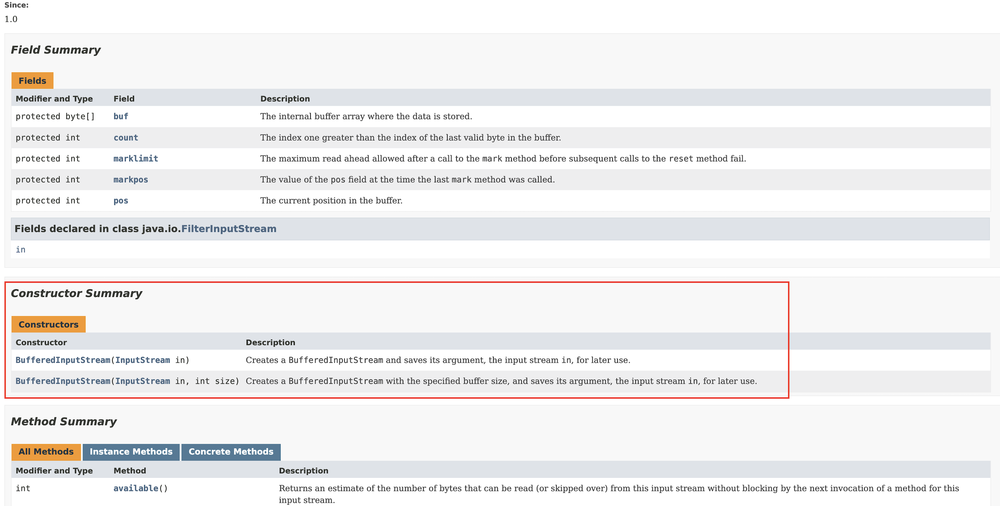

# [item1] 생성자 대신 정적 팩터리 메서드를 고려하라

<br>

>객체를 생성하고 싶을 때?

Car 클래스가 객체를 생성하기 위해 아래와 같은 메서드를 제공한다고 해보자
```java
public class Car {
    
    public Car() {} // (1) 생성자
    
    public static Car of() { // (2) 메서드
        return new Car();
    }
}
```
클라이언트는 총 2가지 방식으로 객체를 생성할 수 있다.   
(1) **생성자** : `Car car = new Car();`을 이용해서 car 객체를 생성한다.   
(2) **메서드** : `Car car = Car.of();`을 이용해서 car 객체를 생성한다.

여기서 (2)번 방식은 `static 메서드`를 사용해서 객체를 생성했다.   
이처럼, **static 메서드**를 사용해서 **객체를 생성**하는 방식을 `정적 팩터리 메서드`라고 한다.

# 정적 팩터리 메서드
정적 팩터리 메서드는 생성자와 비교했을 때, 객체를 생성한다는 점에서 동일하지만,    
장점도 있고 단점도 있다. 장점과 단점을 알아보고 적절한 상황에 적용해보자!

## 정적 팩터리 메서드의 장점
```markdown
(1) 이름을 가질 수 있다.
(2) 불필요한 객체 생성을 피할 수 있다.
(3) 캡슐화를 지킬 수 있고 유연성이 증가된다.
(4) 정적 팩터리 메서드를 작성하는 시점에는 반환할 객체의 클래스가 존재하지 않아도 된다.
```
### (1) 이름을 가질 수 있다.
`public 생성자`는 이름이 객체 클래스명 하나 뿐이다.  
때문에 반환될 객체의 특성을 쉽게 묘사할 이름을 짓기 어렵다.   
하지만 `정적 팩터리 메서드`는 이름을 지을 수 있어 객체의 특성을 묘사할 수 있다.

그 예로, 아래와 같은 `BigInteger` 클래스가 있다고 가정하자.
주어진 생성자와 메서드 모두 `BigInteger` 타입의 소수를 반환한다.
```java
public class BigInteger {
    
    public BigInteger(int Random) { // (1) 생성자
        // ...
    }
    
    public static BigInteger probablePrime(int Random) { // (2) 정적 팩터리 메서드
        // ...
    }
}
```
(1) 생성자를 통해 객체를 얻는다면 `new BigInteger(10)`라는 메서드를 사용할 것이다. 그러나 반환되는 객체가 소수인지 직관적으로 알 수 없다.

(2) 정적 팩터리 메서드를 통해 객체를 얻는다면 `BigInteger.probablePrime(10)`라는 메서드를 사용할 것이다. 이 메서드를 사용하면 소수가 반환되는 것을 직관적으로 이해할 수 있다.


### (2) 불필요한 객체 생성을 피할 수 있다.
생성자를 통해서 객체를 생성하면, 생성자를 호출할 때마다 객체가 생성된다.    
그러나 정적 팩터리 메서드를 사용하면 캐싱을 통해서 메서드를 호출할 때마다 객체가 생성되는 일을 막을 수 있다.
* 예) `Boolean.valueOf(true)`


### (3) 캡슐화가 가능하고 유연성이 높아진다.
팩토리 메서드를 사용하면 메서드의 반환타입의 하위타입 객체를 반환할 수 있기 때문에 캡슐화가 가능하다.

예를 들어보자. 아래와 같이 `Animal` 인터페이스가 있다.
```java
public interface Animal {
    void move();
}
```

이 인터페이스를 구현한 클래스 `Dog`와 `Human`이 있다고 하자.
```java
public class Dog implements Animal {
    
    @Override
    public void move() {
        System.out.println("4발로 이동");
    }
}
```
```java
public class Human implements Animal {
    
    @Override
    public void move() {
        System.out.println("2발로 이동");
    }
}
```
<br> 

이 하위 클래스를 생성하는 `Animals` 클래스가 있다. 이런 역할을 하는 클래스를 `동반 클래스`라고 한다.
```java
public class Animals { // 동반 클래스
    
    public static Animal of(String type) {
        if (type.equals("human")) {
            return new Human();
        }
        return new Dog();
    }
}
```

클라이언트가 `Dog` 객체나 `Human` 객체를 생성하고 싶다면, 아래와 같이 사용할 수 있다.
```java
public class Main {
    public static void main(String[] args) {
        Animal human = Animals.of("human");
        Animal dog = Animals.of("dog");
    }
}
```
`Animals`라는 동반 클래스를 사용하여, 주어진 매개변수에 따라 하위 타입들을 반환할 수 있다. 이는 아래와 같은 장점이 있다.
* **유연성을 증가시킨다.** 단순히 Animals.of() 메서드에 매개변수를 넣어서 다른 타입의 매개변수를 반환할 수 있다.
* **캡슐화를 지킬 수 있다.** Animals.of() 메서드를 통해 얻은 타입은 Animal 이다. 구현체가 어떤 타입인지 알 수 없다. 이는 캡슐화를 지키도록 도와준다.

추가로, java8 이후부터 인터페이스에 `디폴트 메서드`를 구현할 수 있게 되었다.
때문에 동반 클래스인 `Animals`를 없애고 **정적 팩터리 메서드를 인터페이스에 둘 수 있다.**
```java
public interface Animal {
    
    void move();

    static Animal of(String type) { // 정적 팩터리 메서드를 구현
        
        if (type.equals("human")) {
            return new Human();
        }
        return new Dog();
    }
}
```

(만약 생성자를 사용하면 어떻게 될까? 생성자를 사용하면 주어진 매개변수에 따라 하위 타입들을 반환하는 방법은 없다. 때문에 위의 장점을 누릴 수 없다.)


### (4) 정적 팩터리 메서드를 작성하는 시점에는 반환할 객체의 클래스가 존재하지 않아도 된다.
메서드 안에서 객체를 반환할 때,   
당장 클래스가 존재하지 않아도 특정 파일에서 인터페이스의 구현체 위치를 알려주는 곳의 정보를 가지고 해당 객체를 읽어 생성할 수 있다.
```java
public abstract class Fruit {
    
    public abstract void getName();
    
    public static Fruit getNewInstance() {
        try {
            Class<?> class1 = Class.forName("com.android.example.Fruit");
            return (Fruit) class1.newInstance();
        } catch (Exception e) {
        	/* error */
        }
    }
}
```
출처: [생성자 대신 정적 팩토리 메소드를 고려하라](https://velog.io/@alsgus92/Effective-Java-3-2-%EA%B0%9D%EC%B2%B4-%EC%83%9D%EC%84%B1%EA%B3%BC-%ED%8C%8C%EA%B4%B4)

그러나, 생성자를 사용하다면 반드시 클래스가 존재해야 한다.

## 정적 팩터리 메서드의 단점
```markdown
(1) 정적 팩터리 메서드만 제공한다면 하위 클래스를 만들 수 없다.
(2) 정적 팩터리 메서드는 프로그래머가 찾기 어렵다.
```
### (1) 정적 팩터리 메서드만 제공한다면 하위 클래스를 만들 수 없다.
상속을 하려면 public이나 protected 생성자가 필요하다.   
(위 단점은 오히려 장점이 될 수 있다. 이유는 상속보다 컴포지션을 사용하는 것을 유도하기 때문이다.)

### (2) 정적 팩터리 메서드는 프로그래머가 찾기 어렵다.**
생성자는 API 문서에 명확히 드러나있다. 그러나 정적 팩터리 메서드는 일반 메서드 항목에 있어서 찾기 어렵다.


일반 메서드 항목에서 정적 팩터리 메서드라는 것을 알리기 위해 아래와 같은 네이밍을 사용한다.

* `from` : 하나의 매개변수를 받아 해당 타입의 인스턴스를 반환
    * `Date.from(instance)`


* `of` : 여러 매개변수를 받아 적합한 타입의 인스턴스를 반환하는 메서드
    * `EnsumSet.of(JACK, QUEEN, KING)`


* `valueOf` : `from`과 `of`의 더 자세한 버전
    * `BigInteger.valueOf(Integer.MAX_VALUE)`


* `instance` / `getInstance` : 매개변수로 명시한 인스턴스를 반환(같은 인스턴스임을 보장 놉)


* `create` / `newInstance` : `getInstance`와 같지만, 매번 새로운 인스턴스를 생성해 반환함을 보장


* `getType` : `getInstance`와 같지만, 생성할 클래스가 아닌 다른 클래스에 팩터리 메서드를 정의할 때 쓴다.
    * `FileStore fs = Files.getFileStore(path)`


* `newType` : `newInstance`와 같으나, 생성할 클래스가 아닌 다른 클래스에 팩터리 메서드를 정의할 때 쓴다.
    * `BufferedReader br = Files.newBufferedReader(path)`


* `type` : `getType`과 `newType`의 간결한 버전
**
