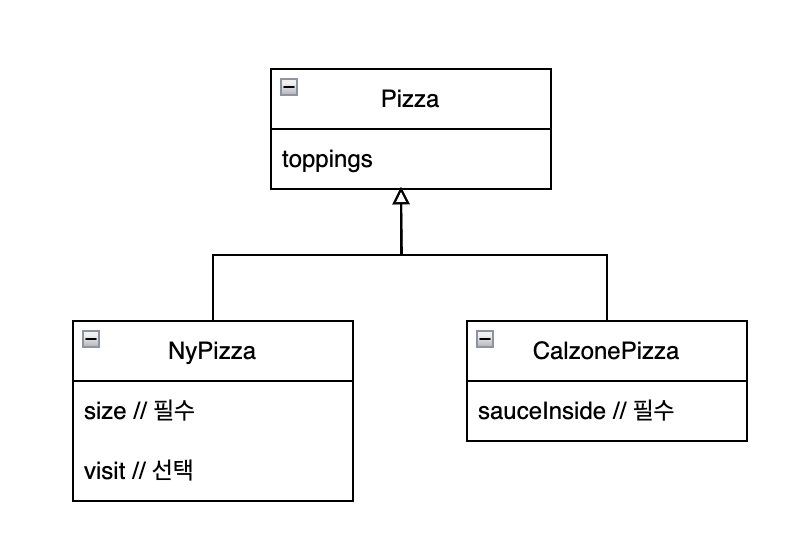

# [item2] 생성자에 매개변수가 많다면 빌더를 고려하라

> 만약 클래스에 매개변수가 많다면 어떨까?

그 예시로 영양성분 정보를 담는 NutritionFacts 클래스가 있다.
```java
public class NutritionFacts {

    private final int serving;          // 필수
    private final int servings;         // 필수
    private final int calories;         // 선택
    private final int fat;              // 선택
    private final int sodium;           // 선택
    private final int carbohydrate;     // 선택

    public NutritionFacts(int serving, int servings, int calories, int fat, int sodium, int carbohydrate) {
        this.serving = serving;
        this.servings = servings;
        this.calories = calories;
        this.fat = fat;
        this.sodium = sodium;
        this.carbohydrate = carbohydrate;
    }
}
```
이 클래스에서 serving, servings는 필수로 필요한 필드이고 나머지는 선택적으로 초기화할 수 있다.   
여기서 생성자의 매개변수 중 필수로 초기화 해야하는 필드를 받는 매개변수를 필수 매개변수라고 하고   
선택으로 초기화 해야하는 필드를 받는 매개변수를 선택 매개변수라고 한다.    


이 클래스를 사용해서 객체를 생성해보자.
```java
public class Main {
    public static void main(String[] args) {
        NutritionFacts nutritionFacts = new NutritionFacts(10, 10, 100, 0, 0, 0);
    }
}
```
이 생성자는 아래와 같은 단점이 있다.
* 선택적 매개변수까지도 반드시 초기화 해야한다. 
  * 만약, serving, servings, calories만 초기화하고 싶어도 나머지 필드 또한 default 값으로 초기화 해야 한다.
* 매개변수가 너무 많아서 어떤 값을 넣어야 하는지 확인하기 어렵다.
  * NutritionFacts 생성자를 직접 찾아봐서 어떤 매개변수 순대로 값을 받는지 확인해야 한다.


이런 단점을 해결하기 위한 방법은 아래와 같다.
```markdown
(0) 모든 매개변수에 맞게 생성자를 제공
(1) 점층적 생성자 패턴
(2) 자바 빈즈 패턴
(3) 빌더 패턴
```
### 모든 매개변수에 맞게 생성자를 제공
위에서 말한 단점 중 선택적 매개변수를 굳이 초기화하지 않기 위해서는 어떻게 해야 할까?   
아래와 같이 각각의 생성자를 제공하면 된다.
```java
public class NutritionFacts {

    private final int serving;          // 필수
    private final int servings;         // 필수
    private final int calories;         // 선택
    private final int fat;              // 선택
    private final int sodium;           // 선택
    private final int carbohydrate;     // 선택

    public NutritionFacts(int serving, int servings) {
        this.serving = serving;
        this.servings = servings;
        this.calories = 0;
        this.fat = 0;
        this.sodium = 0;
        this.carbohydrate = 0;
    }

    public NutritionFacts(int serving, int servings, int calories) {
        this.serving = serving;
        this.servings = servings;
        this.calories = calories;
        this.fat = 0;
        this.sodium = 0;
        this.carbohydrate = 0;
    }

    public NutritionFacts(int serving, int servings, int calories, int fat) {
        this.serving = serving;
        this.servings = servings;
        this.calories = calories;
        this.fat = fat;
        this.sodium = 0;
        this.carbohydrate = 0;
    }

    public NutritionFacts(int serving, int servings, int calories, int fat, int sodium) {
        this.serving = serving;
        this.servings = servings;
        this.calories = calories;
        this.fat = fat;
        this.sodium = sodium;
        this.carbohydrate = 0;
    }

    public NutritionFacts(int serving, int servings, int calories, int fat, int sodium, int carbohydrate) {
        this.serving = serving;
        this.servings = servings;
        this.calories = calories;
        this.fat = fat;
        this.sodium = sodium;
        this.carbohydrate = carbohydrate;
    }
}
```

모든 매개변수에 맞게 생성자를 제공하는 것에 대한 한계
* 중복된 코드가 많다.
* 매개변수가 많아서 어떤 값을 넣어야 하는지 한눈에 파악하기 어렵다.


### 점층적 생성자 패턴
위에서 말한 '중복된 코드가 많다'는 한계를 해결하기 위해 점층적 생성자 패턴을 사용해보자.
점층적 생성자 패턴은 매개변수가 다른 생성자를 호출해서 코드의 중복을 줄인다.
```java
public class NutritionFacts {

    private final int serving;          // 필수
    private final int servings;         // 필수
    private final int calories;         // 선택
    private final int fat;              // 선택
    private final int sodium;           // 선택
    private final int carbohydrate;     // 선택

    public NutritionFacts(int serving, int servings) {
        this(serving, servings, 0);
    }

    public NutritionFacts(int serving, int servings, int calories) {
        this(serving, servings, calories, 0);
    }

    public NutritionFacts(int serving, int servings, int calories, int fat) {
        this(serving, servings, calories, fat, 0);
    }

    public NutritionFacts(int serving, int servings, int calories, int fat, int sodium) {
        this(serving, servings, calories, fat, sodium, 0);
    }

    public NutritionFacts(int serving, int servings, int calories, int fat, int sodium, int carbohydrate) {
        this.serving = serving;
        this.servings = servings;
        this.calories = calories;
        this.fat = fat;
        this.sodium = sodium;
        this.carbohydrate = carbohydrate;
    }
}
```
이렇게 사용하면 코드의 중복이 준 것을 확실히 확인할 수 있다.
그러나 여전히 한계는 있다.
* 매개변수가 많아서 한 눈에 파악하기 어렵다.
  * 생성자를 초기화 하기 위해서 매개변수의 순서를 직접 알아봐야 한다.


### 자바 빈즈 패턴
생성자 초기화를 하기 위해서 매개변수의 순서를 직접 알아보지 않을 수 있는 법이 있다.   
바로 자바빈즈 패턴을 이용하는 것이다.
자바빈즈 패턴은 기본 생성자로 객체를 초기화한 후, setter를 이용해 필드 값을 초기화 하는 것이다.   
setter를 이용하면 어떤 값을 초기화 하는지 쉽게 이해할 수 있다.   
```java
public class NutritionFacts {  
  
    private int serving = -1;          // 필수  
    private int servings = -1;         // 필수  
    private int calories = 0;         // 선택  
    private int fat = 0;              // 선택  
    private int sodium = 0;           // 선택  
    private int carbohydrate = 0;     // 선택  
    
	public NutritionFacts() {}
  
    public void setServing(int serving) {  
        this.serving = serving;  
    }  
  
    public void setServings(int servings) {  
        this.servings = servings;  
    }  
  
    public void setCalories(int calories) {  
        this.calories = calories;  
    }  
  
    public void setFat(int fat) {  
        this.fat = fat;  
    }  
  
    public void setSodium(int sodium) {  
        this.sodium = sodium;  
    }  
  
    public void setCarbohydrate(int carbohydrate) {  
        this.carbohydrate = carbohydrate;  
    }  
}
```
위 클래스를 이용해서 객체를 생성해보자.
```java
public class Main {
    public static void main(String[] args) {
        NutritionFacts nutritionFacts = new NutritionFacts();
        nutritionFacts.setServing(10);
        nutritionFacts.setServings(10);
        nutritionFacts.setCalories(100);
    }
}
```
기본 생성자를 통해서 객체를 생성한 뒤, setter를 이용하여 serving, servings, calories를 설정한다.   
위 패턴은 어떤 값을 초기화 할지 한눈에 알아볼 수 있고 사용 또한 쉽다.

하지만, 자바빈즈패턴은 한계가 있다.
* 언제 객체가 완전히 초기화 되었는지 알 수 없다.
* 클래스를 불변으로 만들 수 없다.
* setter를 통해 이후에 값을 마음대로 바꿀 수 있다.


### 빌더 패턴
자바빈즈 패턴의 한계를 해결하면서 이점을 가질 수 있는 생성 패턴이 있다. 그것이 바로 빌더 패턴이다!   
빌더 패턴은 크게 다음과 같은 로직으로 진행된다.
```markdown
(1) 클래스 내부에 Builder 라는 static 클래스가 있다
(2) Builder 클래스는 기존 클래스가 가지고 있는 필드를 그대로 가지고 있는다.
    선택적 매개변수는 필드에 미리 초기화 되어있다.
(3) 원하는 값에 맞게 Builder 클래스의 객체를 생성한다.
(4) 생성한 Builder 객체를 클래스에 넘겨준다. 
(5) 넘겨 받은 Builder 객체를 이용해서 클래스 객체를 생성한다.
```

빌더 패턴을 이용한 클래스는 아래와 같다.
```java
public class NutritionFacts {  
  
    private int serving;          // 필수  
    private int servings;         // 필수  
    private int calories;         // 선택  
    private int fat;              // 선택  
    private int sodium;           // 선택  
    private int carbohydrate;     // 선택
  
    public static class Builder { // (1) NutritionFacts.Builder 클래스
  
        // (2) 필수 매개변수  
        private int serving;  
        private int servings;  
  
        // (3) 선택 매개변수  
        private int calories = 0;  
        private int fat = 0;  
        private int sodium = 0;  
        private int carbohydrate = 0;  
  
        public Builder(int serving, int servings) {  // (4) NutritionFacts.Builder 생성자
            this.serving = serving;  
            this.servings = servings;  
        }  
  
        public Builder calories(int calories) {  // (5) 선택 매개변수를 초기화 하기위한 메소드
            this.calories = calories;  
            return this;  
        }  
  
        public Builder fat(int fat) {  
            this.fat = fat;  
            return this;  
        }  
  
        public Builder sodium(int sodium) {  
            this.sodium = sodium;  
            return this;  
        }  
  
        public Builder carbohydrate(int carbohydrate) {  
            this.carbohydrate = carbohydrate;  
            return this;  
        }  
  
        public NutritionFacts build() {   // (6) NutritionFacts를 반환하는 메소드
            return new NutritionFacts(this);  
        }  
    }  
  
    private NutritionFacts(Builder builder) {  // (7) NutritionFacts의 생성자. 초기화된 Builder를 받는다.
        this.serving = builder.serving;  
        this.servings = builder.servings;  
        this.calories = builder.calories;  
        this.fat = builder.fat;  
        this.sodium = builder.sodium;  
        this.carbohydrate = builder.carbohydrate;  
    }  
}

```
(1) NutritionFacts.Builder 클래스   
NutritionFacts를 생성하기 위해 미리 값을 Builder에 초기화 하는 클래스이다.

(2) 필수 매개변수      
반드시 넣어야 하는 매개변수이다. Builder 생성자를 호출할 때 반드시 초기화 해야 한다.

(3) 선택 매개변수   
선택적으로 넣어야 하는 매개변수이다. Builder 생성자를 호출할 때 반드시 초기화해야 할 필요는 없지만,    
Builder를 반환하는 메소드를 호출하면 초기화된다.

(4) `public Builder(int serving, int servings)` : NutritionFacts.Builder 생성자   
Builder 생성자이다. 필수 매개변수를 초기화한다.   

(5) `public Builder calories(int calories)` : 선택 매개변수를 초기화 하기위한 메소드   
선택 매개변수를 초기화 하기 위한 메소드이다. 호출하면 Builder를 반환하기 때문에 체이닝을 지원할 수 있다.

(6) `public NutritionFacts build()` : NutritionFacts를 반환하는 메소드
NutritionFacts의 생성자인 `NutritionFacts(Builder builder)`를 호출하여 NutritionFacts를 반환한다.

(7) `private NutritionFacts(Builder builder)` : NutritionFacts의 생성자. 초기화된 Builder를 받는다.
매개변수로 받은 Builder의 각각의 값을 꺼내서 초기화한다.

빌더 패턴을 사용하면 아래와 같이 객체를 생성할 수 있다.
```java
public class Main {  
    public static void main(String[] args) {  
        new NutritionFacts.Builder(10, 10)  
                .calories(10)  
                .build();  
    }  
}
```

이렇게 빌더 패턴을 이용하면 아래와 같은 장점이 있다.
* 선택적 매개변수까지 초기화할 필요 없다.
* 매개변수가 너무 많더라도 값을 쉽게 초기화할 수 있다.
  * 초기화 할 때 체이닝 메서드를 사용하여 직관적이다
* 객체를 완전히 초기화한 시점을 알 수 있다.
* 클래스를 불변으로 만들 수 있다.


하지만 빌더 패턴의 한계도 있다.
* 빌더 패턴을 알아보기 힘들다.
  * 하지만 빌더 패턴을 간소화 하기 위해서 Lombok의 @Builder를 사용할 수 있다.


이렇게 빌더 패턴을 알아봤다!
> 그럼 상속 관계에서 빌더 패턴을 어떻게 이용할까?

### 상속 관계에서 빌더 패턴을 쓰는 법
아래와 같이 상속 관계가 있다고 해보자.   



가장 상위 클래스인 Pizza에서 Builder를 사용한 모습이다.
```java
import java.util.EnumSet;  
import java.util.Set;  
  
public abstract class Pizza {  
  
    public enum Topping {  
        HAM, MUSHROOM, PEPPER, SAUSAGE  
    }  
  
    final Set<Topping> toppings;
  
    abstract static class Builder<T extends Builder<T>> {  // (1) 
  
        EnumSet<Topping> toppings = EnumSet.noneOf(Topping.class); // (2)
        
        public T addTopping(Topping topping) {  // (3)
            toppings.add(topping);  
            return self();  
        } 
  
        protected abstract T self(); // (4)

		abstract Pizza build(); // (5)
    }  
  
    Pizza(Builder builder) {
        this.toppings = builder.toppings;  
    }
}
```
1 `Pizza.Builder<T extends Builder<T>>`   
* Pizza의 Builder이다. Builder 아직 정해지지 않은 T타입을 사용한다.
* T 타입은 Pizza.Builder를 extends한 Builder이다.
  * 예를 들어, `Pizza`의 하위 클래스인 `NyPizza`가 있고 `NyPizza`의 `Builder`가 `Pizza.Builder`를 상속받았으면, `NyPizza.Builder`는 `PizzaBuilder`를 extends 한 클래스이므로 `T`타입이라 할 수 있다.

2 `toppings`
* Pizza 클래스에 넣을 topping을 초기화 한다. 아직 비어있는 리스트이기 때문에 `EnumSet.noneOf(Topping.class)` 을 사용한다.

3  `T addTopping(Topping topping)`
* `Topping`을 초기화 해주기 위한 함수이다.
* `Pizza.Builder` 클래스를 생성할 때 정의하는 `T`타입을 반환한다. (다시 한번 말하지만, `T` 타입은 `Pizza.Builder`를 `extends`한 `NyPizza.Builder`, `CalzonePizza.Builder`이다.)
* `return` 에서 `this`를 리턴하면 `Pizza.Builder`를 `return`하는 것과 같다. 이것은 `T` 타입을 리턴하는 것이 아니다. 때문에 `T` 타입을 리턴하는 `self()`라는 추상 메서드를 만든 뒤, `self()`를 리턴하도록 한다.

4 T self()
* `T` 타입을 리턴하는 추상 메서드이다.
* 이후 `Pizza.Builder`를 `extends`한 구현체를 반환하도록 메서드를 오버라이딩한다.

5 Pizza build()
* `Pizza` 클래스를 반환한다.


`NyPizza` 클래스
* `NyPizza` 클래스는 `Pizza` 클래스를 상속받는다.
* `size`라는 필수 매개변수를 갖는다.
* `visit`이라는 선택 매개변수를 갖는다.

```java
public class NyPizza extends Pizza {  
  
    public enum Size {  
        SMALL, MEDIUM, LARGE;  
    }  
  
    private final Size size;  // 필수
  
    private final boolean visit; // 선택 


    public static class Builder extends Pizza.Builder<Builder> {  // (1)
  
        private final Size size;  // 필수 매개변수  
  
        private boolean visit = true;  // 선택 매개변수  
  
        public Builder(Size size) {  // (2)
            this.size = size;  
        }  
  
        public Builder visit(boolean visit) {  // (3)
            this.visit = visit;  
            return this;  
        }  

        @Override  
        protected Builder self() {  // (4)
            return this;  
        }  
        
        @Override  
        NyPizza build() {   // (5)
            return new NyPizza(this);  
        } 
    }  
  
    NyPizza(Builder builder) {  
        super(builder);  
        this.size = builder.size;  
        this.visit = builder.visit;  
    }  
}
```

1 `NyPizza.Builder` 위에서 본 Pizza.Builder 클래스를 상속받는다.
* `Pizza.Builder`에서 정의해 줘야하는 `T`타입은 `NyPizza.Builder`로 정의한다.
* 즉 `Pizza.Builder`의 자식 클래스인 `NyPizza.Builder`를 T 타입으로 정의한 것이다. (이것을 재귀적 타입 한정이라고 한다.)

2 Builder(Size size)
* `NyPizza`의 `size`는 필수 매개변수이기 때문에, `Builder`를 생성할 때, `size`를 받도록 한다.

3 Builder visit(boolean visit)
* `NyPizza`의 `visit`은 선택 매개변수이기 때문에, `visit`이라는 함수를 통해 초기화 가능하도록 정의한다.

4 Builder self()
* `NyPizza.Builder`를 반환하도록 구현한다.
* `Pizza.Builder` 클래스에서 `T addTopping()`함수를 사용하여 토핑을 추가할 때, `NyPizza.Builder`를 반환하도록 한다.

5 NyPizza build()
* 값을 초기화한 `NyPizza`를 반환한다.
* 기존에는 `Pizza`를 반환했지만 `NyPizza`를 반환하도록 변경할 수 있다.(공변환 타이핑)
> 공변환 타이핑을 쓰면 클라이언트가 형변환에 신경쓰지 않고도 빌더를 사용할 


`CalzonePizza` 클래스
* `Pizza` 클래스를 상속받는다.
* `sauceInside`라는 필수 매개변수를 갖는다.
```java
public class CalzonePizza extends Pizza {  
  
    public final boolean sauceInside; // 필수  
  
    public static class Builder extends Pizza.Builder<Builder> {  
  
        public final boolean sauceInside;  
  
        public Builder(boolean sauceInside) {  
            this.sauceInside = sauceInside;  
        }  
  
        @Override  
        CalzonePizza build() {  
            return new CalzonePizza(this);  
        }  
  
        @Override  
        protected Builder self() {  
            return this;  
        }  
    }  
  
    CalzonePizza(Builder builder) {  
        super(builder);  
        this.sauceInside = builder.sauceInside;  
    }  
}
```


**빌더 패턴을 사용하는 방법**
* 필수 매개변수는 Builder 생성자를 사용한다.
* 선택 매개변수는 체이닝 메서드를 사용한다.
```java
public class Main {  
    public static void main(String[] args) {  

        NyPizza nyPizza = new NyPizza.Builder(Size.LARGE)  
                .addTopping(Topping.SAUSAGE)  
                .addTopping(Topping.HAM)  
                .visit(false)  
                .build();  
  
        CalzonePizza calzonePizza = new CalzonePizza.Builder(true)  
                .addTopping(Topping.PEPPER)  
                .build();  
    }  
}
```


#### 그럼 빌더 패턴은 언제 사용할까?(기준)
* 매개변수가 4개 이상은 되어야 값어치를 한다. 
  * 하지만 API는 시간이 지날 수록 매개변수가 많아지는 경향이 있음을 명심하자. 
  * 매개변수가 많아질 때 빌더패턴으로 전환하는 방법도 있지만 이전에 만들어둔 생성자와 정적 팩토리를 관리하는 동시에 진행하는 것은 어려울 것이다. 
  * 그니까 애초에 빌더로 시작하자
