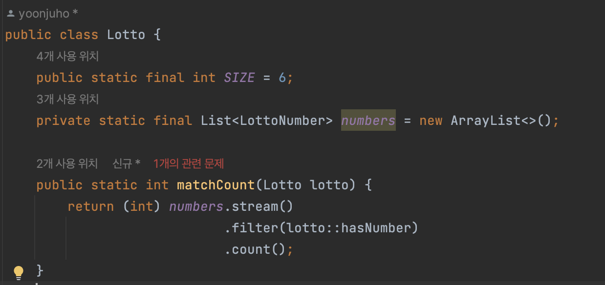

# 아이템04: 인스턴스화를 막으려거든 private 생성자를 사용하라

## 정적 메서드와 정적 필드만을 담은 클래스 예시

정적 메서드와 정적 필드만을 담은 클래스를 만들고 싶을 때가 존재한다.
<br> (객체지향적으로 사고하지 않는 사람들이 종종 남용하는 방식이기도 하다.)




하지만 `Math`와 `Arrays`처럼 기본 타입 값이나 배열 관련 메서드들을 모아놓을 수 있다.

```java
// java.lang.Math
public static final double PI = 3.14159265358979323846;

// java.util.Arrays.java
public static void sort(int[] a, int fromIndex, int toIndex) {
        rangeCheck(a.length, fromIndex, toIndex);
        DualPivotQuicksort.sort(a, 0, fromIndex, toIndex);
}
```

또한, `java.util.Collections`처럼 특정 인터페이스를 구현하는 객체를 생성해주는 정적 메서드(or 팩토리)를 모아놓을 수도 있다.

```java
// java.util.Collections

public static <T> Collection<T> unmodifiableCollection(Collection<? extends T> c) {
        if (c.getClass() == UnmodifiableCollection.class) {
            return (Collection<T>) c;
        }
        return new UnmodifiableCollection<>(c);
    }

    /**
     * @serial include
     */
    static class UnmodifiableCollection<E> implements Collection<E>, Serializable {
        @java.io.Serial
        private static final long serialVersionUID = 1820017752578914078L;

        @SuppressWarnings("serial") // Conditionally serializable
        final Collection<? extends E> c;

        UnmodifiableCollection(Collection<? extends E> c) {
            if (c==null)
                throw new NullPointerException();
            this.c = c;
        }
    ...
```

마지막으로 `final` 클래스와 관련한 메서드들을 모아놓을 때도 사용한다.
<br>
**→ 유틸리티 클래스 생성을 위해**
<br>
(`final` 클래스를 상속해서 하위 클래스에 메서드를 넣는 건 불가능하기 때문에)

## 정적 멤버 혹은 메서드만을 가진 클래스 인스턴스화

정적 멤버만 담은 유틸리티 클래스는 인스턴스로 만들어 쓰려고 설계한 게 아니다.
(`Collections` -> 특정 인터페이스를 구현하는 객체를 생성해주는 정적 메서드를 모아놓은 것)

생성자를 명시하지 않으면 컴파일러가 자동으로 기본 생성자를 만들어준다
<br>
매개변수를 받지 않는 `public` 생성자가 만들어지며 의도치 않게 인스턴스화 할 수 있게 된 클래스가 종종 있다

또한, 추상 클래스로 만드는 것으로는 인스턴스화를 막을 수는 없다
<br>
→ 하위 클래스를 만들어 인스턴스화 하면 그만이기 때문에

## 그러면 어떻게 해야 인스턴스화를 막을 수 있을까?

**`private` 생성자를 추가하면 클래스의 인스턴스화를 막을 수 있다**

- 상속을 불가능하게 하는 효과도 존재

  모든 생성자는 명시적이든 묵시적이든 상위 클래스의 생성자를 호출하게 되는데,<br>
  이를 `private`으로 선언했으니 하위 클래스가 상위 클래스의 생성자에 길이 막혀버린다


```java
public class UilityClass {
    //기본 생성자가 만들어지는 것을 막는다
    private UtilityClass(){
        throw new AssertionError();
      }
}
```

> **AssertionError**는 코드가 개발자의 기대대로 작동하지 않는 경우를 나타내는 데 사용된다.
<br> **AssertionError**는 프로그램의 논리적 오류나 잠재적인 버그를 포착할 때 유용하다. 


꼭 예외를 `AssertionError`를 던질 필요는 없지만, 클래스 안에서 실수로라도 생성자를 호출하지 않도록 해준다.

생성자가 분명 존재하는데 호출할 수 없다는 것은 그다지 직관적이지 않으니 적절한 주석 또한 달아두도록 하자.

## 핵심 정리
- 인스턴스화를 막으려거든 `private` 생성자를 사용하라.
- 생성자가 분명 존재하는데 호출할 수 없다는 것은 그다지 직관적이지 않으니 적절한 주석 또한 달아두도록 하자.
