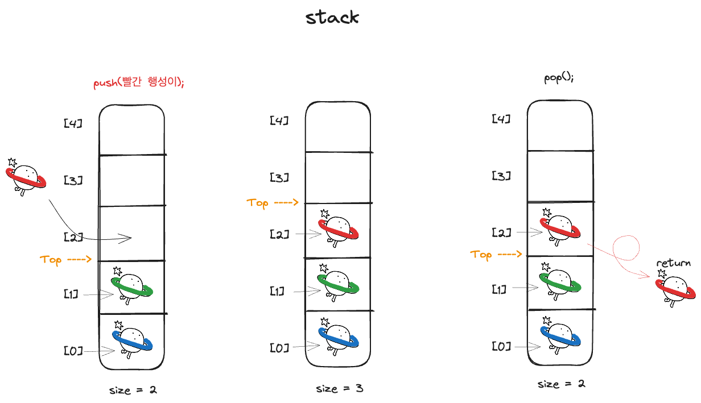
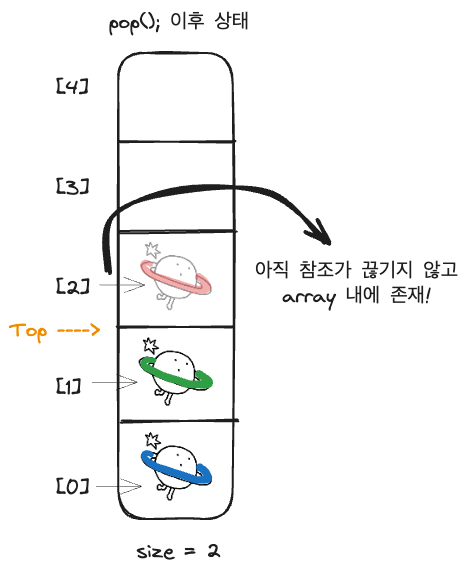
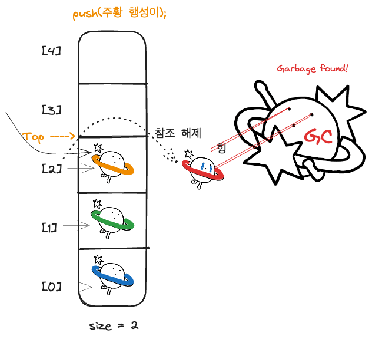

# Item 7: 다 쓴 객체 참조를 해제하라

> KEYWORD: GC, Memory Leak, Obsolete Reference, Weak Reference


들어가기에 앞서, Java의 Garbage Collection에 대한 기본적인 이해가 필요하다.

---
## JVM의 메모리, 그리고 Garbage Collection

### 기본 개념

**Garbage Collection(이하 GC)** 은 더 이상 프로그램 코드에서 사용되지 않는 객체들을 자동으로 검출하고, 그 메모리를 회수하는 프로세스이다. 객체가 "Garbage"로 판단되는 시점은 주로 그 객체에 대한 **모든 참조가 사라졌을 때**이다.

### 메모리 영역

Java 메모리는 크게 다음 세 가지 주요 영역으로 나뉜다:

1. **힙(Heap)**: 객체와 배열이 동적으로 할당되는 곳. 가비지 컬렉션이 주로 이루어지는 영역이다.
2. **스택(Stack)**: 각 Thread마다 실행 스택이 있으며, 메소드 호출과 함께 로컬 변수들이 할당된다.
3. **메소드 영역(Method Area)**: Class 레벨의 정보(클래스명, 부모 클래스명, 메소드, 변수)가 저장되는 곳이다.

### 가비지 컬렉션 프로세스

Java의 가비지 컬렉션 프로세스는 크게 마킹(Marking)과 스위핑(Sweeping)의 두 단계로 나눌 수 있다:

1. **마킹(Marking)**: GC는 모든 "Garbage"가 아닌 객체를 Marking한다. 이 과정에서는 루트 집합(Root Set)으로부터 도달 가능한 객체들을 탐색한다. 루트 집합은 스레드 스택과 정적 변수에서 참조하는 객체들을 포함한다.
2. **스위핑(Sweaping)**: Marking 과정에서 도달할 수 없는 객체들을 메모리에서 제거한다.

-> 단순하게 비유해본다면, 우리나라를 Root Set이라고 할 때 우리가 물리적으로 직접 걸어서 갈 수 있는 곳을 Marking한다고 하자.
그렇다면 다리나 육로로 이어져있지 않는(참조되지 않은) 다른 대륙이나 섬(미국이나 일본, 제주도 등)은 Marking 할 수 없을 것이다. 그리고 이런 Marking 할 수 없는 장소들을 **Garbage**로 간주한다.


그렇다면 GC가 어떤 상황일 때 사용을 다한 객체가 차지하는 메모리를 해제하지 못하는 것일까? 아래 글에서 이어서 생각해보자

---

## Stack을 예시로 한 Memory Leak

### 다리는 놓여 연결되어있지만(참조 되고 있지만) 실제로는 가지 못하는 땅(Garbage)

이펙티브 자바 아이템 7에서는 Memory leak가 발생하는 예시로 Stack 자료 구조를 사용할 때를 집었다.
다음은 책에 소개된 Stack을 이용한 코드이다.

```java
public class Stack {
	private Object[] elements;
	private int size = 0;
	private static final int DEFAULT_INITIAL_CAPACITY = 16;
	
	public Stack() {
		elements = new Object[DEFAULT_INITIAL_CAPACITY];
	}
	
	public void push(Object e) {
		ensureCapacity(); elements [size++] = e;
	}
	
	public Object pop() {
		if (size = 0)
			throw new EmptyStackException(); return elements|-size];
	}
	
	/**
	* 원소를 위한 공간을 적어도 하나 이상 확보한다.
	* 배열 크기를 늘려야 할때마다 대략 두 배씩 놀린다.
	*/
	private void ensureCapacity () {
		if (elements. length = size)
			elements =Arrays.copyOf(elements, 2 * size + 1); 
	}
	
}

```

먼저 코드를 먼저 분석해보자. Stack 자료 구조는 최초에 `Object`로 구성된 크기 16의 Array로 이루어져있다. 추가적인 Object가 array에 push 메서드를 통해 추가될 수 있고, pop 메서드를 통해 해당 stack array에서 제거된다.

 여기서 눈여겨 봐야할 부분이 있다.
```java
	private int size = 0;
	
	...
	
	public void push(Object e) {
		ensureCapacity(); elements [size++] = e;
	}
	
	public Object pop() {
		if (size = 0)
			throw new EmptyStackException();
		return elements[--size];
	}
```

 제공된 Stack 클래스는 초기의 맴버 변수로 존재하는 **size를 통해 현재 `TOP`이 어디에 존재하는지 파악**한다. 
> 그리고 오직 push와 pop 메서드의 실행을 통해서만 size의 값이 1씩 커지거나 작아진다.

 - Push: size와 같은 index가 해당 Object를 참조하게 한 후 1 씩 커지게 됨
 - Pop: size를 1 씩 감소시킨 후 해당 index에 존재하는 Object를 return 한다.
 
### 그래서 무엇이 문제인가?

> 원문 발췌:
 언듯 보기에 특별한 문제는 없어보인다. 하지만 꽁꽁 숨어 있는 문제가 있다. 이는 바로 'Memory Leak'로, 이 Stack을 사용하는 프로그램을 오래 실행하다 보면 점차 GC활동 과 memory 사용량이 늘어나 결국 성능이 저하될 것이다. 상대적으로 드문 경우긴 하지만 심할 때는 Disk Paging이나 `OutofMemoryError`를 일으켜 프로그램이 예기치 않게 종료 되기도 한다.
 
 (Disk Paging과 Out Of Memory에 관해서는 나중에 Operation System CS 정리글을 통해 정리해볼 예정이다.)

### 자세히 들여다보자



pop() 메서드는 `-- size` 를 통해 1 작아진 index에 접근하여 그 객체값을 return하는 것으로 Stack에서 제거되었다고 간주한다!




하지만 실제로는 size로 나타내지는 TOP의 index 값이 작아지면서 TOP보다 큰 index에 존재하는 객체에 접근할 수 없게 된 것 뿐이다. -> size로 표현되는 index로만 접근 가능하기 때문!

pop 되어 조회할 수 없는 index에 위치하게된 객체들은 push 메서드를 통해 size(TOP index)가 커져야 해당 index를 조회할 수 있다.
그리고 비로소 push 메서드를 통해 array index가 참조하는 reference value가 바뀌어야만 앞서 pop된 객체의 reference가 끊어진다.



즉, pop을 통해 Stack에서 제거된 것으로 간주하는 객체는 조회가 불가능할 뿐이며, 새로운 객체가 push 되어 객체가 위치한 index에 재할당 되기 전까지 Stack array가 참조를 유지하고 하고 있다는 뜻이다.

앞서 설명했듯, GC는 이러한 참조가 끊기지 않은 객체를 Garbage로 간주하지 않는다. 그렇기에 사용하지 않는, 실질적으로 조회가 불가능한 객체임에도 불구하고 Collect되지 않아 memory leak를 야기되는 것이다!

---

그렇다면 어떻게 해야될까?

### 해결책: 다 쓴 객체 참조를 해제하라


제대로 구현한 pop 메서드는 다음과 같다.
```java
	public Object pop() {
		if (size = 0)
			throw new EmptyStackException();
		Object result = elements[--size];
		elements[i] = null; // 다 쓴 참조 해제
		return result;
	}
```
> 궁금한 점! elements[size] = null; 이라고 하면, elements의 [size]에 존재하는 빨간행성이의 reference가 null이 되는 것인가? 아니면 elements[size]가 null을 참조하게 되는 것인가?

pop으로 stack에서 제거된 것으로 간주된 객체의 자리에 null을 할당함으로써 객체 참조를 끊어낸다면, GC는 참조가 끊어진 빨간 행성이를 수거해갈 것이다.

그런데 우리는 null을 사용하는 것에 대해 조심해야된다고 들은 바가 있을 것이다.. 그렇기에 다 사용한 객체의 참조를 끊기 위해 null을 할당하는 것도 하나의 방법이지만, 사실은 그럴 필요도 없고 바람직하지도 않다. 필요 이상으로 프로그램을 지저분하게 만들 뿐이라고 한다.

따라서, **객체 참조를 null 처리하는 일은 예외적인 경우여야 한다**.

다 쓴 참조를 해제하는 가장 좋은 방법은 그 참조를 담은 변수를 유효범위(scope) 밖으로 밀어내는 것이다. 개발자가 이 변수의 범위를 최소가 되게 정의 했다면 (Item 57) 이 일은 자연스럽게 이뤄진다.

##### null 처리를 언제 해줘야할까?
자기 메모리를 직접 관리하는 클래스라면 개발자는 항시 메모리 누수에 주의해야 한다. 원소를 다 사용한 즉시 그 원소가 참조한 객체들을 다 null 처리해줘야한다.

그리고 자기 메모리를 직접 관리하는 클래스에 대해서는 아래에서 살펴보도록 하자.

---

그리고 Stack 외에도 다음과 같은 클래스들이 자신에게 할당된 메모리를 직접 관리하며, 다음과 같은 경우에 memory leak가 발생할 수 있다고 한다.
#### 1. ArrayList에서의 메모리 누수

##### 1-1. 참조 유지

- **세부 설명**: `ArrayList`에서 객체를 제거할 때, 해당 인덱스의 요소를 `null`로 설정하지 않으면, `ArrayList`는 해당 객체에 대한 참조를 계속 유지합니다. 이로 인해 가비지 컬렉터가 이 객체를 회수할 수 없게 됩니다.

##### 1-2. 크기 조절 미흡

- **세부 설명**: `ArrayList`의 크기가 커진 후 많은 요소가 제거되었을 때, 내부 배열의 크기가 자동으로 줄어들지 않습니다. 이 경우, 사용하지 않는 메모리 공간이 여전히 할당된 채로 남아 있어 메모리 누수가 발생할 수 있습니다.

#### 2. HashMap에서의 메모리 누수

##### 2-1. 키의 불변성 문제

- **세부 설명**: `HashMap`에서는 키로 사용되는 객체의 해시코드가 변경되지 않도록 불변 객체를 사용해야 합니다. 만약 키 객체의 상태가 변경되어 해시코드가 변하면, 해당 키는 더 이상 올바른 버킷에 위치하지 않게 되어 메모리 누수가 발생할 수 있습니다.

##### 2-2. 엔트리의 참조 유지

- **세부 설명**: `HashMap`에서 키-값 쌍을 제거하더라도, 해당 엔트리 객체의 참조가 다른 곳에서 유지되고 있으면, 가비지 컬렉터가 그 메모리를 회수할 수 없습니다. 이는 특히 대형 데이터 구조에서 문제가 될 수 있습니다.

#### 메모리 누수 방지 방법

- **객체 제거 시 참조 제거**: 객체를 컬렉션에서 제거할 때는 참조도 함께 제거하거나 `null` 처리를 하여 가비지 컬렉터가 회수할 수 있도록 합니다.
- **적절한 크기 조절**: `ArrayList`의 경우, `trimToSize()` 메소드를 사용하여 내부 배열의 크기를 현재 요소 수에 맞게 조절할 수 있습니다.
- **불변 객체 사용**: `HashMap`의 키로는 불변 객체를 사용하여, 객체의 상태 변경으로 인한 해시코드 변경을 방지합니다.
