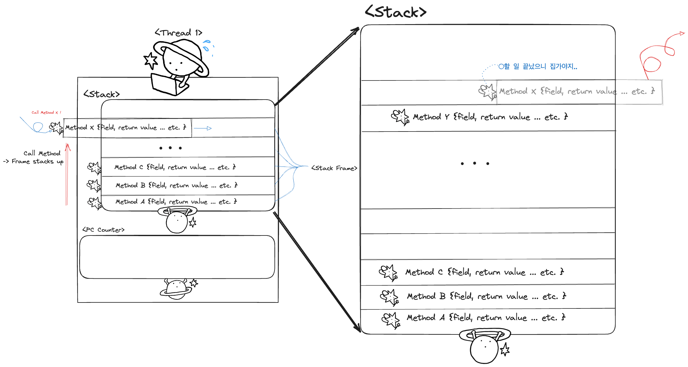
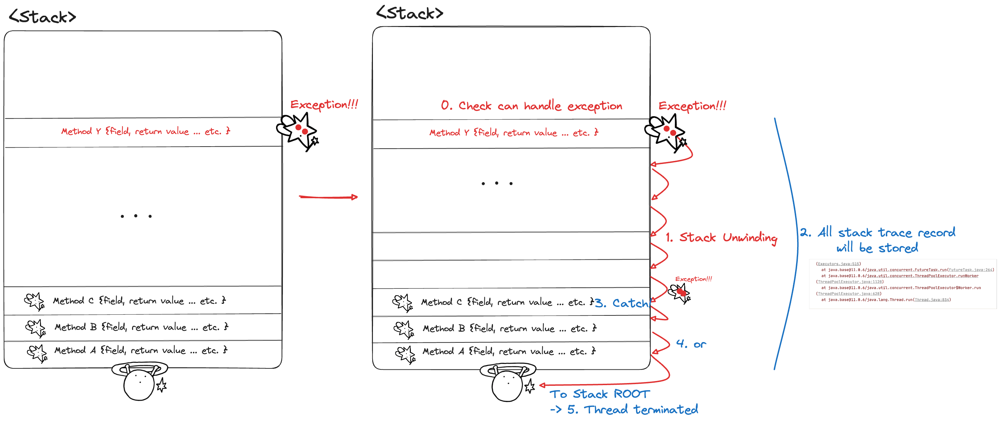

# Item 9: try-finally보다 try-with-resources를 사용하라

> KEYWORD: Exception, Thread Pool, AutoCloseable, 예외처리

들어가기에 앞서, 컴파일된 Java 코드가 실행되는 환경인 JVM에서 어플리케이션 실행 중 발생한 예외(Exception)를 어떻게 처리하는지 간단히 짚고 넘어가보자.


## JVM에서 애플리케이션 구동과 Exception 처리

  
JVM에서 각 스레드(Thread)는 자신만의 호출 스택(Call Stack)을 가지며, 이 스택은 메소드 호출과 함께 실행될 때마다 그 메소드의 실행 상태를 스택 프레임(Stack Frame) 형태로 저장한다. 

Java에서 예외 처리는 스레드와 스택 트레이스(Stack Trace)를 통해 이해할 수 있는 복잡한 과정을 포함한다.
예외 처리의 논리적 흐름은 다음 단계로 구성된다:

### 1. 스택 프레임(Stack Frame)과 스레드(Thread)


- **스택 프레임**(Stack Frame): JVM에서 각 메소드 호출은 스택 프레임을 생성한다. 이 프레임은 지역 변수, 작업 중인 부분 결과 및 메소드 내 연산에 대한 정보를 저장한다. 메소드가 실행을 마치면, 해당 스택 프레임은 스택에서 팝(pop)되어 제거된다.
- **스레드**(Thread): 각 스레드는 독립적인 호출 스택을 가지고 있으며, 자바 프로그램에서 동시에 여러 작업을 수행할 수 있게 한다. 스레드가 실행 중 예외를 만나면, 그 예외를 처리하기 위해 해당 스레드의 스택 범위 내에서 예외를 처리한다.

### 2. 예외 발생 시의 스택 동작



- **Exception 발생**: Exception이 발생하면, JVM은 현재 stack frame에서 exception를 처리할 수 있는지 확인한다. 이는 현재 stack frame에서 exception을 처리할 수 있는 `catch` 블록이 있는지 검사하는 과정을 포함한다. 자주 사용하는 try-catch문의 catch문이 발생한 예외 클래스를 파라미터로 받아 처리할 수 있는지 확인하는 과정이 이것 중 하나이다.
- **스택 언와인딩(Stack Unwinding)**: 처리할 수 있는 `catch` 블록이 현재 frame에 없다면, JVM은 call stack을 역으로 따라가면서 각 frame을 pop하고, 각 메소드의 `catch` 블록을 찾는다. 이 과정은 적절한 `catch` 블록을 찾거나 stack의 root에 도달할 때까지 계속된다.
- **스택 추적 정보**: Exception이 발생한 위치와 stack의 상태는 stack trace 에 기록됩니다. 이 정보는 개발자가 exception의 원인을 파악하고 문제를 해결하는 데 필요한 상세 정보를 제공한다.

### 3. 예외 처리

- **Exception 포착 및 처리**: 적절한 `catch` 블록을 찾으면, JVM은 그 블록으로 실행 흐름을 이동시키고, exception 객체를 `catch` 블록의 매개변수로 전달한다. 이 블록은 exception을 로깅하거나, 사용자에게 알림을 보내거나, 오류를 복구하는 등의 작업을 수행할 수 있다.
- **처리되지 않은 exception**: 만약 모든 stack frame을 검사했음에도 적절한 `catch` 블록을 찾지 못하면, 예외는 처리되지 않은 것으로 간주된다. 이 때, JVM은 thread를 종료하며 이는 종종 프로그램 전체에 영향을 줄 수도 있다.


## try-finally: 전통적인 자원 닫기 수단

예외가 발생하거나 매서드에서 반환되는 경우를 포함해서, 전통적으로 자원이 제대로 닫힘을 보장하는 수단으로 `try-finally`가 쓰였다. 

```java
static String firstLinefFile(String path) throws IOException {
	BuferedReader br = new BuferedReader n(ew FileReader (path));
	try {
		return br. readline();
	} finally {
		br.close();
	} 
}
```
> 자주 보던 try-finally문의 모습이다.

### 1. 왜 사용하지 말아야 할까?

#### 1-1. 유지보수와 가독성을 해치게 된다

 사용 후 닫아야 하는 자원의 수가 늘어난다면 코드가 `try-finally`문으로 도배될 것이며, 이는 유지 보수성과 가독성을 심각하게 해치게 된다!

또한, 이렇게 된다면 자원을 제대로 `close`하지 않는 실수가 매우 매우 빈번하게 발생한다고 한다!
- 2007년의 자바 라이브러리에서는 close 매서드가 제대로 구현된 비율이 1/3 정도 밖에 되지 않는다고..

#### 1-2. 예외 발생 시 정확한 디버깅을 어렵게 한다.

예외는 try문과 finally문에서 둘 다 발생할 수 있다. 예시를 한 번 살펴보자

1. 모종의 이유로 try문의 코드가 자원 발행을 실패하여 예외가 발생했다고 하자.
2. 그렇다면 try문을 해당 코드 라인에서 즉시 종료 후 finally문을 실행할 것이다. 
3. finally문에 존재하는 자원.close() 매서드 또한 제대로 할당되지 않는 자원을 닫는 코드를 실행하게 된다.
4. close() 매서드 실행에서도 예외가 발생하게 된다.

이때, finally문에서 발생한 예외가 아직 기록되지 않은 try문에서의 첫 번째 예외를 무시하고 stack trace에 기록될 것이다.

-> 이렇게 된다면, 실제 시스템에서의 실제로 예외가 발생한 지점을 파악하기 어렵게 된다! (~~디버깅하는 개발자는 운다~~)


### 2. try-with-resource: 그렇다면 이걸 쓰면 된다!

#### 2-0. 우선 AutoCloseable Interface를 구현해야한다!

수많은 라이브러리들의 수많은 클래스와 인터페이스가 이미 AutoCloseable을 구현하거나 확장해두었다고 하니, 닫아야하는 자원을 가지는 클래스를 작성한다면 반드시 구현해야한다!

아래는 JPA에서 자주 사용하는 `EntityManager`와 `EntityTransaction`에 AutoCloseable을 구현한 예시 코드이다.

**코드 예시**
```java
// JPA에서 사용하는 AutoCloseable을 구현하는 래퍼 클래스 정의
public class AutoCloseableEntityManager implements AutoCloseable {
	private EntityManager entityManager;

	public AutoCloseableEntityManager(EntityManager entityManager) {
		this.entityManager = entityManager;
	}

	@Override
	public void close() {
		if (this.entityManager.isOpen()) {
			this.entityManager.close();
		}
	}
}

public class AutoCloseableEntityManager implements AutoCloseable {
	private EntityManager em;
	
	public AutoCloseableEntityManager(EntityManager em) {
		this.em = em;
		}
		
	@Override
	public void close() {
		 if (this.em.isOpen()) {
		  this.em.close(); 
		} 
	} 
}

```

#### 2-1. try-with-resource를 사용해보자

사용할 자원이 1개라면 이렇게!

```java
static String firstLineOfFile(String path) throws IOException {

	try (BufferedReader br = new BufferedReader(new FileReader (path))) {
		return br. readline();
	}
	
}
```

여러 개라면 이렇게 사용할 수 있다!

```java
static void copy(String src, String dst) throws IOException {
	try (InputStream in = new FileInputStream(src);
		OutputStream out = new FileOutputStream(dst)) {
		byte[] buf = new byte [BUFFER_SIZE];
		int n;
		while (n =in.read(buf)) => 0)
			out.write(buf, 0, n);
	}
}
```

#### 2-2. 무엇이 더 좋아졌는가?

1. 우선, 첫 번째 문제였던 유지 보수성과 가독성이 좋아졌다.
	- try문에서 사용할 코드의 재료(resource)를 미리 만들어놓고, 꺼내 쓴 다음 알아서 종료하게 하는 깔끔한 코드가 되었다.
	- 자원을 사용할 때마다 적어야 하는 `finally - close()` 코드 중복을 제거할 수 있다.
	- 자원을 할당하지 못하며 예외가 발생하더라도, 자원을 할당하면서 발생한 첫 번째 예외가 stack trace에 기록되며 그 뒤에 발생한 예외들은 `suppressed` 태그를 달고 출력된다고 한다.
	- 후에 발생한 예외들도 JAVA 7에 추가된 `getSuppressed` 메서드를 사용하면 가져올 수 있다고 한다!
2. catch 절과 함께 한다면 더욱 좋을 수 있다.
	- catch 절을 함께 쓴다면, try문을 중첩하지 않아도 다수의 자원에서 발생하는 예외를 처리할 수 있다!

```java
static String firstLineOfFile(String path) {

	try (BufferedReader br = new BufferedReader(new FileReader (path))) {
		return br. readline();
	} catch (IOException e) {
		// 예외 처리 코드
	}
	
}

```

 
### 3. JDBC, JPA에 try-with-resource를 적용해보자

JDBC와 JPA 작업에서는 DB 연결, Statement, ResultSet 등 자원을 자주 관리해야하는 코드에서 유용하게 사용될 수 있다. 이런 자원들을 안전하게 닫아 자원 누수를 방지하는 데 매우 유용하다.

#### 3-1. JDBC 예시

JDBC를 사용할 때는 `Connection`, `Statement`, `ResultSet` 등의 객체를 생성하게 된다. 이 객체들은 사용 후에 반드시 닫아야 하는 자원들이기에, try-with-resources를 사용하면 이러한 자원을 간편하게 관리할 수 있다!

**코드 예시**
```java
public class JDBCSample {
    public static void main(String[] args) {
        String url = "jdbc:mysql://localhost:3306/database_name";
        String username = "username";
        String password = "password";

        // Try-with-resources statement
	    try (Connection conn = DriverManager.getConnection(url, username, password);
             PreparedStatement stmt = conn.prepareStatement("SELECT * FROM employees WHERE department = ?");
             ResultSet rs = stmt.executeQuery()) {
			
			// JDBC를 이용한 코드 사용문
			
        } catch (SQLException e) {
            e.printStackTrace();
        }
    }
}

```

**설명**:
- `Connection`, `PreparedStatement`, `ResultSet` 객체는 try 문 안에서 선언된다. 이들은 모두 `AutoCloseable` 인터페이스를 구현하므로, 블록을 벗어날 때 자동으로 `close()` 메소드가 호출된다.
- `PreparedStatement`에 파라미터를 설정하고, 쿼리를 실행합니다.
- 모든 JDBC 작업은 예외를 발생시킬 수 있으므로, 이를 처리하기 위해 `catch` 절을 포함하면 된다.


#### 3-2. JPA 예시

JPA에서는 `EntityManager`와 `EntityTransaction`과 같은 객체를 다루게 되는데, 이 객체들도 자원을 열고 닫으며 적절히 관리해야 한다. 앞서 작성했던 AutoCloseable을 implement한 클래스를 이용하여 코드를 작성해보았다.

```java

public class JPASample {
    public static void main(String[] args) {

        // EntityManagerFactory and EntityManager를 try-with-resources에 이용해보자.
        try (AutoCloseableEntityManagerFactory autoCloseableEmf = new AutoCloseableEntityManagerFactory("persistenceUnitName");
             AutoCloseableEntityManager autoCloseableEm = new AutoCloseableEntityManager(autoCloseableEmf.createEntityManager())) {

            autoCloseableEm.em.getTransaction().begin();
            
            // JPA operations, e.g., find, persist, merge, remove
            
            autoCloseableEm.em.getTransaction().commit();
        } catch (Exception e) {
            if (autoCloseableEm.em.getTransaction().isActive()) {
                autoCloseableEm.em.getTransaction().rollback();
            }
            e.printStackTrace();
        }
    }
}

```
**코드설명:**

1. try-with-resources 사용:
- AutoCloseableEntityManagerFactory와 AutoCloseableEntityManager 두 객체를 try-with-resources 문에서 생성힌다. 이렇게 함으로써 블록을 벗어날 때 자동으로 이들 객체의 close() 메소드가 호출되어 자원이 안전하게 해제된다.
2. 트랜잭션 관리:
- 트랜잭션을 시작하고, JPA 작업을 수행한 후 커밋한다. 예외가 발생하면 롤백을 수행한다.

