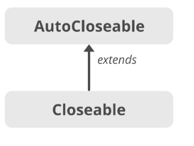

# try-finally의 문제점
자바 라이브러리에는 `InputStream`, `OutputStream`, `java.sql.Connection`등 close 메서드를 호출해 직접 닫아줘야 하는 자원이 많다.  
자원 닫기는 놓치기 쉬워 예측할 수 없는 성능 문제로 이어지기도 한다.

전통적으로 이를 해결하기 위해 try-finally가 쓰였다.  
다만 이는 몇 가지 문제점들이 있다.

## 코드의 지저분함
try-finally 방식은 아래 코드와 같이 자원이 둘 이상일 경우 코드가 너무 지저분해지고, 실수를 저지를 가능성이 커진다.
```java
static void copy(String src, String dst) throws IOException {
    Inputstream in = new FileInputStream(src);
    try {
        OutputStream out = new FileOutputStream(dst);
        try {
            byte[] buf = new byte[BUFFER_SIZE];
            int n;
            while ((n=in.read(buf)) >= 0){
                out.write(buf, 0, n);
            }
        } finally {
            out.close();
        }
    } finally {
        in.close();
    }
}
```

## 예외가 겹침
예외는 try 블록과 finally 블록 모두에서 발생할 수 있다.

아래 코드를 통해 살펴보자.
```java
static String firstLineOfFile(String path) throws IOException {
    BufferedReader br = new BufferedReader(new FileReader(path));
    try {
        return br.readLine();
    } finally {
        br.close();
    }
}
```
만약 기기에 물리적인 문제가 발생하여 readLine 메서드가 예외를 던진다고 하면, 같은 이유로 close 메서드도 실패하고 결국 try와 finally 모두에서 예외를 던지게 된다.  
그러면 스택 추적 내역에 첫 번째 예외에 관한 정보는 남지 않고, finally 블록에서 발생한 예외만 체크하게 된다.  
이는 실제 시스템에서의 디버깅을 몹시 어렵게 한다.

# try-with-resources
이러한 문제들은 자바 7에서 등장한 try-with-resources 덕에 모두 해결되었다.

한 가지 주의할 점은 이 구조를 사용하기 위해서는 해당 자원이 `AutoCloseable` 인터페이스를 반드시 구현해야 한다.  
`AutoCloseable` 인터페이스는 void를 반환하는 close 메서드 하나만 덩그러니 정의한 인터페이스다.

다음은 try-with-resources를 사용하여 firstLineOfFile 메서드를 재작성한 예다.
```java
static String firstLineOfFile(String path) throws IOException {
    // before
    BufferedReader br = new BufferedReader(new FileReader(path));
    try {
        return br.readLine();
    } finally {
        br.close();
    }  
    
    // after
    try (BufferedReader br = new BufferedReader(new FileReader(path))) {
        return br.readLine();
    }
}
```

아래는 가장 위의 코드인 copy 메서드에 try-with-resources를 적용한 모습이다.
```java
static void copy(String src, String dst) throws IOException {
    // before
    Inputstream in = new FileInputStream(src);
    try {
        OutputStream out = new FileOutputStream(dst);
        try {
            byte[] buf = new byte[BUFFER_SIZE];
            int n;
            while ((n = in.read(buf)) >= 0) {
                out.write(buf, 0, n);
            }
        } finally {
            out.close();
        }
    } finally {
        in.close();
    }
        
    // after
    try (Inputstream in = new FileInputStream(src);
        OutputStream out = new FileOutputStream(dst)) {
        byte[] buf = new byte[BUFFER_SIZE];
        int n;
        while ((n = in.read(buf)) >= 0) {
            out.write(buf, 0, n);
        }
    }
}
```

try-with-resources 버전이 짧고 읽기 수월할 뿐 아니라 문제를 진단하기도 훨씬 좋다.

이전에 예시를 들었던 firstLineOfFile 메서드에서 readLine과 close 호출 양쪽에서 예외가 발생하는 경우를 떠올려보자.  
만약 try-with-resources를 사용한다면 close에서 발생한 예외는 숨겨지고 readLine에서 발생한 예외가 기록된다.  

또한, 이렇게 숨겨진 예외들도 그냥 버려지지 않고, 스택 추적 내역에 `숨겨졌다(suppressed)`는 꼬리표를 달고 출력된다.  
자바 7에서 Throwable에 추가된 getSuppressed 메서드를 이용하면 프로그램 코드에서 가져올 수도 있다.

보통의 try-finally에서처럼 catch 절을 사용할 수 있고, 이 덕분에 try문을 더 중첩하지 않고도 다수의 예외를 처리할 수 있다.

# 결론
꼭 회수해야 하는 자원을 다룰 때는 try-finally 말고, try-with-resources를 사용하자.  
이는 권장이 아닌 **필수**이다.  
코드는 더 짧고 분명하며, 만들어지는 예외 정보도 훨씬 유용하다.  
사용하지 않을 이유가 전혀 없다.

# 부록
몰라도 되지만 재미있는 사실이 하나 있다.  
그건 바로 기존의 Closeable에 부모 인터페이스로 AutoCloseable을 추가했다는 점이다.  
보통은 반대로 사용하는 것이 일반적인데 자바 개발자들은 먼저 만들어진 Closable 인터페이스에 부모 인터페이스인 AutoClosable을 추가함으로써 하위 호환성 100%를 달성했다.  



만약 Closeable을 부모로 만들었다면 기존에 Closeable을 사용하던 모든 클래스를 AutoCloseable을 사용하도록 변경해야했을 것이다. 

이로 인해 기존에 Closeable을 사용하던 모든 클래스들은 try-with-resources에서 사용할 수 있게 되었다.
