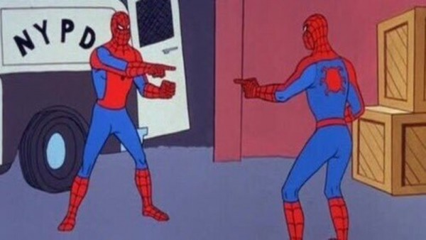

> KEYWORD: 객체 동등성, logical equality, 상속, 재정의, 자바

equals 메서드의 재정의는 많은 Java 개발자가 직면하는 일반적인 문제이다. Object 클래스의 equals 메서드는 매우 기본적인 동등성만을 제공하기 때문에, 더 복잡한 동등성을 요구하는 클래스에서는 이를 재정의해야 할 필요가 있다. 하지만 재정의 없이 Object의 기본 메서드를 사용하는 것이 더 적합한 경우도 많다. 재정의를 결정하기 전에 고려해야 할 몇 가지 중요한 상황을 살펴보자.

## equals 메서드 재정의를 피해야 할 경우

### 1. 인스턴스가 본질적으로 고유할 때

- **고유 인스턴스**: 일부 클래스는 각 인스턴스가 고유해야 하며, 이 경우 Object의 기본 equals 메서드가 적합하다. 예를 들어, `Thread` 클래스는 각 스레드가 독립적인 실행 흐름을 나타내므로, 기본 동등성이 적합하다.

### 2. 논리적 동치성 검사가 필요 없을 때

- **논리적 동치성 불필요**: `java.util.regex.Pattern`과 같은 일부 클래스는 논리적 동치성을 검사할 수 있지만, 이 기능이 반드시 필요하지 않을 수 있다. 패턴의 예를 들어, 설계자가 클라이언트가 이 기능을 필요로 하지 않는다고 판단했다면, Object의 equals만으로 충분하다.

### 3. 상위 클래스에서 적절히 재정의된 equals 메서드

- **상속 받은 equals**: `Set`, `List`, `Map` 등의 컬렉션 프레임워크는 이미 적절하게 equals 메서드가 재정의되어 있다. 예를 들어, `HashSet`은 `AbstractSet`의 equals를 상속받아 사용하며, 이는 대부분의 경우에 적합하다.

### 4. 클래스 접근성이 제한적이고 equals 호출 필요 없을 때

- **제한적 클래스**: 클래스가 `private`이거나 `package-private`인 경우, 외부에서 equals 메서드가 호출될 일이 없다. 이런 경우, 클래스 내부에서만 인스턴스 동등성을 관리하기 때문에 재정의할 필요가 없다.

## equals 메서드를 재정의해야 할 경우



equals 메서드를 재정의하는 것은 클래스의 논리적 동치성을 표현할 필요가 있을 때 고려해야 한다. 논리적 동치성은 두 객체의 상태가 같은지를 판단하는 것으로, 예를 들어 두 `Account` 객체가 같은 계좌번호를 가지고 있을 때 동등하다고 판단할 수 있다. 

### 재정의 고려사항


- 반사성: null이 아닌 모든 참조 값 `x`에 대해 `x.equals(x)`는 `true`여야 한다.
- **대칭성**: `x.equals(y)`가 `true`라면 `y.equals(x)`도 `true`여야 한다.
- **추이성**: `x.equals(y)`와 `y.equals(z)`가 `true`라면 `x.equals(z)`도 `true`여야 한다.
- **일관성**: 두 객체가 변경되지 않는 한, `x.equals(y)`의 호출 결과는 항상 동일해야 한다.
- **null에 대한 대응**: `x.equals(null)`은 항상 `false`를 반환해야 한다.

### 재정의 예시

```java
public class Account {
	private String accountNumber;
	public Account(String accountNumber) {
		 this.accountNumber = accountNumber;
	}
	@Override
		public boolean equals(Object obj) {
		if (this == obj) return true;         
		if (obj == null || getClass() != obj.getClass()) 
			return false;         
		Account account = (Account) obj;         
		return accountNumber != null ? accountNumber.equals(account.accountNumber) : account.accountNumber == null;
	}      

```

**설명**:

- **대칭성과 추이성 보장**: 이 구현은 두 `Account` 객체가 같은 `accountNumber`를 가질 때만 `true`를 반환하도록 한다.
- **일관성과 null 처리**: 계좌 번호가 변경되지 않는 한, equals의 결과는 항상 같으며, null 입력에 대해서는 `false`를 반환한다.

equals 메서드의 올바른 재정의는 객체 간의 동등성을 정확하게 표현하는 데 중요하다. 하지만 불필요한 경우 재정의를 피함으로써 오류 가능성을 줄이고 성능을 최적화할 수 있다.

---


## 그렇다면 어떻게 재정의해야 하는가?


Java에서 `equals` 메서드의 올바른 구현은 객체 간의 동등성 비교를 정확하게 수행하도록 하는 핵심적인 부분이다. 이 메서드는 잘못 구현되었을 경우, 데이터의 일관성을 해칠 수 있으므로 주의 깊게 구현해야 한다. `equals` 메서드 구현 시 고려해야 할 주요 단계를 살펴보자!

### equals 메서드 구현의 주요 단계

### 1. 자기 자신의 참조인지 확인

- **자기 자신과의 비교**: 
	가장 먼저, 입력된 객체가 자기 자신의 참조인지 확인한다. 이는 `==` 연산자를 사용해 수행하며, 자기 자신과의 비교에서는 항상 `true`를 반환한다. 이 단계는 비교 작업이 복잡한 상황에서 성능 최적화를 제공한다.


```java
if (this == obj) {
	return true; 
}
```

### 2. 올바른 타입인지 확인

- **타입 검사**: 
  입력된 객체가 올바른 타입인지 `instanceof` 연산자로 검사한다. 올바른 타입이 아니라면 `false`를 반환한다. 대상 클래스 또는 때에 따라 특정 인터페이스가 올바른 타입이 될 수 있다. 예를 들어, 컬렉션 인터페이스(`Set`, `List`, `Map`, `Map.Entry` 등)는 자신을 구현한 다른 클래스 간의 비교도 가능하게 설계된 경우가 많다.
```java
if (!(obj instanceof MyClass)) {
	return false;
}
```


### 3. 올바른 타입으로 형변환

- **형변환**: 
  앞서 `instanceof` 검사를 통과했다면, 입력 객체를 올바른 타입으로 안전하게 형변환한다. 이 단계는 `instanceof` 검사가 성공했기 때문에 안전하다.
```java
MyClass other = (MyClass) obj;
```


### 4. 핵심 필드 비교

- **필드 비교**:
   마지막 단계에서는 입력 객체와 자기 자신의 '핵심' 필드들이 모두 일치하는지 하나씩 검사한다. 모든 필드가 일치하면 `true`를, 하나라도 다르면 `false`를 반환한다. 만약 2단계에서 인터페이스를 사용했다면, 입력 객체의 필드 값을 가져올 때도 그 인터페이스의 메서드를 사용해야 한다. 타입이 클래스라면, 접근 권한에 따라 해당 필드에 직접 접근할 수도 있다.

```java
if (!field1.equals(other.field1)) return false; if (!field2.equals(other.field2)) return false; 
// 추가적인 필드 비교 return true;
```


## 예시: 간단한 SpiderMan 클래스의 equals 메서드 구현


```java
public class SpiderMan {
    private String universe;  // 멀티버스 내의 우주
    private String name;      // 스파이더맨의 실제 이름

    public SpiderMan(String universe, String name) {
        this.universe = universe;
        this.name = name;
    }

    @Override
    public boolean equals(Object obj) {
        if (this == obj) return true; // 자기 자신과의 비교
        if (!(obj instanceof SpiderMan)) return false; // 올바른 타입 검사
        SpiderMan other = (SpiderMan) obj; // 올바른 타입으로 형변환
        return universe.equals(other.universe) && name.equals(other.name); 
        // 핵심 필드 비교
    }

    @Override
    public int hashCode() {
        int result = universe.hashCode();
        result = 31 * result + name.hashCode();
        return result;
    }
}

```


**설명**:

- 이 구현은 자기 자신과의 비교, 올바른 타입 검사, 형변환, 필드 비교를 차례로 수행한다.
- 이름과 나이 필드가 모두 일치할 경우에만 `true`를 반환한다. 이는 객체 간의 동등성을 정확하게 판단할 수 있도록 한다.

올바른 `equals` 메서드의 구현은 객체의 동등성을 정확히 판단하는 데 매우 중요하다. 잘못된 구현은 데이터의 불일치를 초래할 수 있으므로, 위의 단계를 체계적으로 따르는 것이 좋다.
