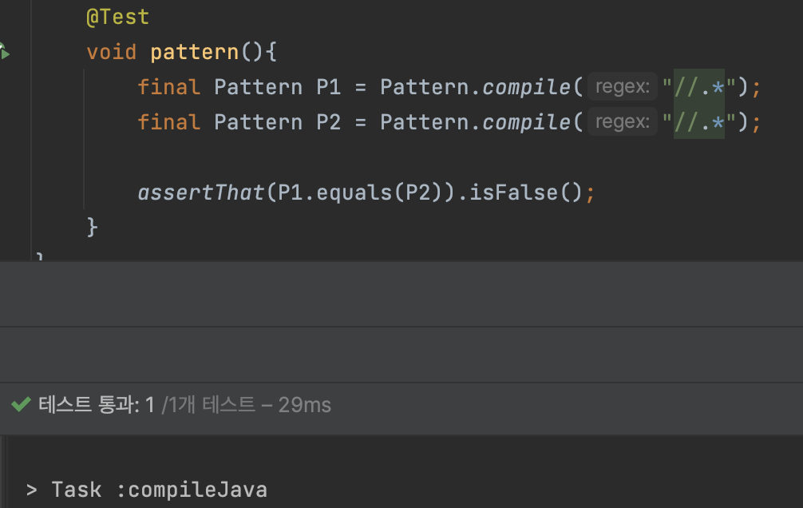
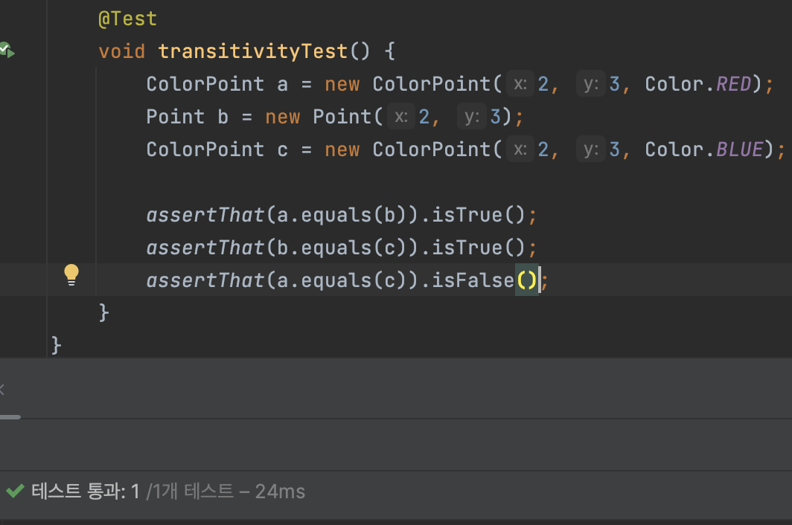
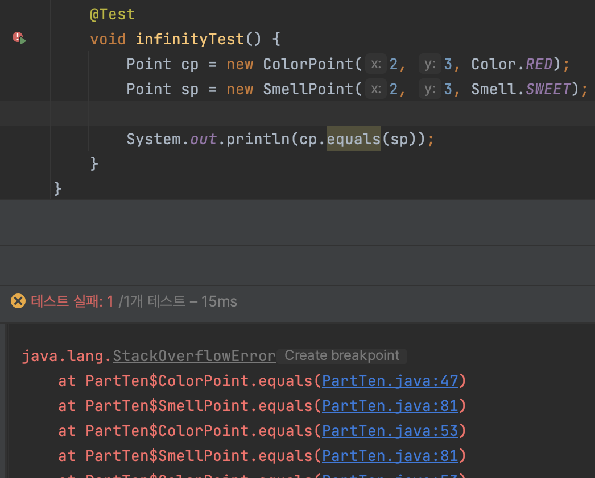

# 아이템 10 : equals는 일반 규칙을 지켜 재정의하라

> `equals` 메서드는 재정의하기 쉬워 보이지만 곳곳에 함정이 도사리고 있어 끔직한 결과를 초래하기도 한다.
> 

## 재정의 하지 말아야 할 상황

### 각 인스턴스가 본질적으로 고유

- 값을 표현하는게 아닌, `Thread`와 같이 동작하는 개체를 표현하는 클래스가 해당

```java
// Thread.java

@Override
public boolean equals(Object obj) {
    if (obj == this)
        return true;

    if (obj instanceof WeakClassKey) {
        Class<?> referent = get();
        return (referent != null) &&
                (((WeakClassKey) obj).refersTo(referent));
    } else {
        return false;
    }
}
```

### 인스턴스의 논리적 동치성을 검사할 일이 없는 경우

- `java.util.regex.Pattern`은 `equals`를 재정의해서 두 `Pattern`의 인스턴스가 같은 정규표현식을 나타내는지를 검사하는(=논리적 동치성을 검사하는) 방법도 존재하지만 그럴 이유가 없다면 재정의 하지 말아라.

  
    

### 상위 클래스에서 재정의한 equals가 하위 클래스에도 딱 들어맞는 경우

- `Set` 구현체는 `AbstractSet`이 구현한 `equals`를 상속받아 쓰고,
`List` 구현체는 `AbstractList`로부터,
`Map` 구현체들은 `AbstractMap`으로부터 상속받아 쓴다.

### 클래스가 `private`이거나 `package-private(default)`이고 `equals` 메서드를 호출할 일이 없다.

- `equals`가 실수라도 호출되는 걸 막고 싶다면 아래와 같이 구현하자

```java
@Override 
public boolean equals(Object o) {
   throw new AssertionError();  // 호출금지! 
}
```

### 그렇다면 언제 equals를 재정의 해야할까?

<aside>

📌 객체 식별성(두 객체가 물리적으로 같은가)이 아닌 **논리적 동치성**을 확인해야 하는데,
상위 클래스의 `equals`가 **논리적 동치성**을 비교하도록 재정의되지 않았을 때
→ `VO`가 여기에 해당
→ `Map`의 키와 `Set`의 원소로 사용 가능해진다.

</aside>

> 값 클래스라 해도, 값이 같은 인스턴스가 둘 이상 만들어지지 않음을 보장하는 인스턴스 통제 클래스라면 `equlas`를 재정의하지 않아도 된다.
→ `Enum`이 여기에 해당
→ 이 경우 논리적 동치성과 객체 식별성이 같은 의미가 된다.
> 

`equlas`를 재정의할 때는 반드시 일반 규약을 따라야 한다.

> `equlas` 메서드는 동치관계(`equivalence relation`)를 구현하며, 아래를 만족한다.
**(동치 관계를 만족시키기 위한 5가지 요건)**
> 

### 반사성

- `null`이 아닌 모든 참조 값 x에 대해, `x.equals(x)는 true다`
    - 객체가 자기 자신과 같아야 한다는 뜻
    (만족시키지 못하기가 더 어렵다)

### 대칭성

- `null`이 아닌 모든 참조 값 x, y에 대해 `x.equals(y)` 가 `true`면 `y.equals(x)`도 `true`이다
    
    ```java
    public final class CaseInsensitiveString {
    
    	private final String str;
    
    	public CaseInsensitiveString(String str) {
    	    this.str = Objects.requireNonNull(str);
    	}
    
    	@Override
    	public boolean equals(Object o) {
    	    if (o instanceof CaseInsensitiveString) {
    	        return str.equalsIgnoreCase(((CaseInsensitiveString) o).str);
    	    }
    
    	    if (o instanceof String) {// 한 방향으로만 작동한다.
    				return str.equalsIgnoreCase((String) o);
    	    }
    	    return false;
    	 }
    }
    
    void symmetryTest() {
      CaseInsensitiveString caseInsensitiveString = new CaseInsensitiveString("Test");
      String test = "test";
      System.out.println(caseInsensitiveString.equals(test));// true
      System.out.println(test.equals(caseInsensitiveString));// false
    }
    
    ```
    

### 추이성

- `null`이 아닌 모든 참조 값 x, y, z에 대해 `x.equals(y)`가 `true`이고, `y.equals(z)`도 `true`면, `x.equlas(z)`도 `true`다
    
    ```java
    // Point
    public class Point {
    
    private final int x;
    private final int y;
    
    public Point(int x, int y) {
        this.x = x;
        this.y = y;
    }
    
    @Override
    public boolean equals(Object o) {
        if (!(o instanceof Point)) {
            return false;
        }
        Point p = (Point) o;
        return this.x == p.x && this.y == p.y;
      }
    }
    
    // ColorPoint
    public class ColorPoint extends Point {
    
    private final Color color;
    
    public ColorPoint(int x, int y, Color color) {
    	super(x, y);
    	this.color = color;
    }
    
    @Override
    public boolean equals(Object o) {
        if (!(o instanceof Point)) {
            return false;
        }
    
    // o가 일반 Point이면 색상을 무시햐고 x,y 정보만 비교한다.
    if (!(o instanceof ColorPoint)) {
            return o.equals(this);
        }
    
    // o가 ColorPoint이면 색상까지 비교한다.
    return super.equals(o) && this.color == ((ColorPoint) o).color;
      }
    }
    ```
    
    

    **무한재귀에 빠질 수도 있다**
    
    ```java
    public class SmellPoint extends Point {
      private final Smell smell;
      
      public SmellPoint(int x, int y, Smell smell) {
                super(x, y);
                this.smell = smell;
    	}
    
      @Override
      public boolean equals(Object o) {
        if (!(o instanceof Point)) {
          return false;
      }
    
    	if (!(o instanceof SmellPoint)) {
          return o.equals(this);
        }
    
    	return super.equals(o) && this.smell == ((SmellPoint) o).smell;
      }
    }
    ```
    
    
    
    <aside>
    
    📌 **이 현상은 모든 객체 지향 언어의 동치관계에서 나타나는 근본적인 문제이다.
    구체 클래스를 확장해 새로운 값을 추가하면서 `equals` 규약을 만족시킬 방법은 존재하지 않는다.**
    
    </aside>
    
    **(해결방안..?)** 추이성을 지키기 위해서 `Point`의 `equals`를 각 클래스들을 `getClass`를 통해서 같은 구체 클래스일 경우에만 비교하도록 하면 어떨까?
    
    ```java
    @Override
    public boolean equals(Object o) {
    	if(o = null || o.getClass() != getClass())
    		return false;
    	Point p = (Point) o;
    	return p.x == x && p.y == y; 
    }
    
    ...
    
    // Set<Point> unitCircle
    // p가 CounterPoint로 이루어져 있는 경우
    // contains는 내부적으로 equals를 호출하기에 false 반환
    public static boolean onUnitCircle(Point p) {
     return unitCircle.contains(p);
    }
    
    ```
    
    - `Point`를 상속받은 `CounterPoint`(**값을 추가하지 않는 방식으로 확장한 것**)가 있을 때 `equals`에서 `false`를 반환할 것이다
    - 즉 동작은 하지만, **리스코프 치환원칙을 위배한 것
    → Point의 하위 클래스는 정의상 여전히 Point이므로 어디서든 Point로써 활용될 수 있어야 한다.**
    
    **(해결방안..!)** 
    
    **상속보다는 구성을 이용하라**
    
    ```java
    public class ColorPoint2 {
    
      private Point point;
      private Color color;
    
      public ColorPoint2(int x, int y, Color color) {
        this.point = new Point(x, y);
        this.color = Objects.requireNonNull(color);
      }
    
      public Point asPoint() {
        return this.point;
      }
    
      @Override
      public boolean equals(Object o) {
        if (!(o instanceof ColorPoint)) {
          return false;
        }
        ColorPoint cp = (ColorPoint) o;
        return this.point.equals(cp) && this.color.equals(cp.color);
      }
    }
    
    ```
    
    > 추상 클래스의 하위클래스에서라면 `equals` 규약을 지키면서도 값을 추가할 수 있다.
    상위 클래스를 직접 인스턴스로 만드는게 불가능 하다면 지금까지 이야기한 문제들은 일어나지 않는다.
    > 
    

### 일관성

- `null`이 아닌 모든 참조 값 x, y에 대해, `x.equals(y)`를 반복해서 호출하면 항상 `true`를 반환하거나 항상 `false`를 반환한다
    
    ```java
    @Test
    void consistencyTest() throws MalformedURLException {
      URL url1 = new URL("www.xxx.com");
      URL url2 = new URL("www.xxx.com");
    
      System.out.println(url1.equals(url2));// 항상 같지 않다.
    }
    ```
    
    - `java.net.URL` 클래스는 `URL`과 매핑된 `host의 IP주소`를 이용해 비교하기 때문에 같은 도메인 주소라도 나오는 `IP`정보가 달라질 수 있기 때문에 반복적으로 호출할 경우 결과가 달라질 수 있다.
    - 따라서 이런 문제를 피하려면 **equals는 항시 메모리에 존재하는 객체만을 사용한 결정적 계산을 수행해야 한다.**

### Null-아님

`null`이 아닌 모든 참조 값 x에 대해, `x.equals(null)`은 `false`다

- 명시적으로 `null`검사를 할 필요는 없고 `instanceof`를 이용하자
(입력이 `null`이면 타입 확인 단계에서 `false`를 반환하기에)

```java
if (!(o instanceof Point)) {
    return false;
}
```

## 좋은 equals 메서드 재정의 방법

```java
@Override
public boolean equals(final Object o) {
// 1. == 연산자를 사용해 입력이 자기 자신의 참조인지 확인한다.
	if (this == o) {
      return true;
  }

// 2. instanceof 연산자로 입력이 올바른 타입인지 확인한다.
	if (!(o instanceof Point)) {
      return false;
  }

// 3. 입력을 올바른 타입으로 형변환 한다.
// -> 2번 단계를 거치기에 무조건 성공
	final Piece piece = (Piece) o;

// 4. 입력 개체와 자기 자신의 대응되는 핵심 필드들이 모두 일치하는지 하나씩 검사한다.

// float와 double을 제외한 기본 타입 필드는 == 를 사용한다.
// float와 double을 특별취급 하는 이유는 Float.NaN, -0.0f, 특수한 부동소수값 등을 다뤄야 하기 때문이다.
// float와 double 필드는 각각 정적 메서드인 Float.compare(float, float) 와 Double.compare(double, double)로 비교
	return this.x == p.x && this.y == p.y;

// 필드가 참조 타입이라면 equals를 사용한다.
	return str1.equals(str2);

// null 값을 정상 값으로 취급한다면 Objects.equals로 NullPointException을 예방하자.
	return Objects.equals(Object, Object);
}

```

어떤 필드를 먼저 비교하느냐가 `equlas`의 성능을 좌우하기도 한다
(다를 가능성이 더 크거나 비교하는 비용이 싼 필드를 먼저 비교)

---

## 핵심정리

- 꼭 필요한 경우가 아니면 재정의 하지 말자
- **equals를 재정의 할때는 hashcode도 반드시 재정의하자**
- 너무 복잡하게 해결하려 들지 말자
필드들의 동치성만 검사해도 `equals` 규약을 어렵지 않게 지킬 수 있다.
- 핵심필드를 빠짐없이 위의 5가지 규약을 지키며 재정의하자
- **equals의 매개변수 입력을 Object가 아닌 타입으로는 선언하지 말자**
(입력타입이 `Object`가 아니므로 재정의가 아닌 다중정의이다)
- 대다수의 `IDE`가 `AutoValue`(`equals`를 재정의 해주는 프레임워크)와 같은 기능을 제공한다.