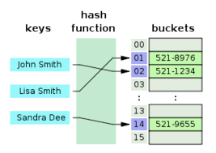
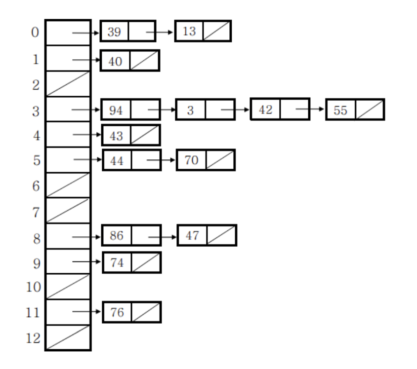

# 아이템 11: equals를 재정의하려거든 hashCode도 재정의하라

> hashCode : 객체의 주소값을 변환하여 생성한 객체의 고유한 정수값
> 

### **equals를 재정의한 클래스 모두에서 hashCode도 재정의해야 한다**

- 그렇지 않으면, `hashCode` 일반 규약을 어기게 되어 해당 클래스의 인스턴스를 `HashMap`이나 `HashSet`같은 컬렉션의 원소로 사용할 때 문제를 일으킬 것이다

> 해시 테이블은 각각의 `key`값에 해시함수를 적용해 배열의 고유한 `index`를 생성하고,
이 `index`를 활용해 값을 저장하거나 검색하게 된다.
> 



## Object 명세

(1) `equals` 비교에 사용되는 정보가 변경되지 않았다면, 애플리케이션이 실행되는 동안그 객체의 `hashCode` 메서드는 몇 번을 호출해도 일관되게 항상 같은 값을 반환해야 한다

- 단, 애플리케이션을 다시 실행한다면 이 값이 달라져도 상관없다

(2) **`equals(Object)`가 두 객체를 같다고 판단했다면, 두 객체의 hashCode는 똑같은 값을 반환해야 한다**

(3) `equals(Object)`가 두 객체를 다르다고 판단했더라도, 두 객체의 hashCode가 서로 다른 값을 반환할 필요는 없다

- 단, 다른 객체에 대해서는 다른 값을 반환해야 해시테이블의 성능이 좋아진다

### 크게문제가 되는것은 2번째 조항

- 즉, 논리적으로 같은 객체는 같은 해시코드를 반환해야 한다.
    
    ```java
    Map<PhoneNumber, String> m = new HashMap<>();
    
    m.put(new PhoneNumber(707, 867, 5309), "제니");
    // 이 코드 다음에
    
    m.get(new PhoneNumber(707, 867, 5309));
    //실행하면 null 반환
    ```
    
    - `PhoneNumber`클래스는 hashCode를 재정의 하지 않았기 때문에 논리적 동치인두 객체가 서로 다른 해시코드를 반환하여 두번째 규약을 지키지 못한다
    - `get` 메서드는 엉뚱한 해시 버킷에 가서 객체를 찾으려 한다.
    - 두 인스턴스를 같은 버킷에 담았더라도 여전히 `null`을 반환한다.
    (`HashMap`은 해시코드가 다른 엔트리끼리는 동치성 비교 시도조차 하지 않도록 최적화 되어있다.)

## 잘못된 HashCode 구현 방법

```java
@Override
public int hashCode() {
	return 42;
}
```

- 모든 객체에게 똑같은 값만 내어주므로 모든 객체가 해시테이블의 버킷 하나에 담겨 마치 연결리스트처럼 동작한다.
- 이 결과 평균 수행시간이 O(1)인 해시테이블이 O(n)으로 느려지게 된다.


(체인법)

## 좋은 해시코드 재정의 요령

1. `int result = c`
→ `c`는 해당 객체의 첫번째 핵심필드(`equals` 비교에 사용되는 필드)를 단계 2.1 방식으로 계산한 해시코드
2. `c` 의 계산 방식
    1. 해당 필드의 해시코드 `c`를 계산한다
        1. 기본 타입 필드(`int` 등)라면 Type.hashCode(필드)
        `Type(= 기본타입의 박싱 클래스)` 
        2. 참조 타입 필드면서 이 클래스의 `equals` 메서드가 이 필드의 `equals`를 재귀적으로 호출해 비교한다면, 이 필드의 `hashCode`를 재귀적으로 해출한다. 
        <br> `ex) getLadder().getLadderRow().getLine()`
        계산이 복잡해진다면 표준형을 만들어 그 표준형의 `hashCode` 호출
        [표준형이란 해당 필드가 `equals` 메서드에 사용될 때 비교되는 형식](https://stackoverflow.com/questions/24427586/what-is-a-canonical-representation-of-a-field-meant-to-be-for-equals-method/24428722#24428722)
        필드의 값이 `null`이면 `0`을 사용
        3. 필드가 배열이라면, 핵심 원소에 대해 위의 1, 2 방식으로 해시코드 계산하여 비교, 모든 원소가 핵심 원소라면 `Arrays.hashCode` 이용
        배열에 핵심 원소가 하나도 없다면 `0`
        `(핵심원소 : 배열 내에서 다수를 차지하는 원소)` 
    2. 단계 2.1에서 계산한 해시코드 `c`로 `result`를 갱신한다.
    `result = 31 * result + c`
3. `result`를 반환

> 파생 필드(핵심 필드에서 부터 계산되어진 필드)는 해시코드 계산에서 제외해도 된다.
또한 `equals` 비교에 사용되지 않은 필드`(ex: lock)`는 반드시 제외해야한다.
> 

> `31`인 이유는 홀수이면서 소수 또한
`31 * result` 이 곱셈을 시프트 연산과 뺄셈으로 대체해 최적화 할 수 있기 때문에
(31 * i 는 (i << 5) -i와 같다)
> 

```java
public class PhoneNumber{

  private Short areaCode;
  private Short prefix;
  private Short lineNum;

  @Override
  public int hashCode() {
      int result = Short.hashCode(areaCode);
      result = 31 * result + Short.hashCode(prefix);
      result = 31 * result + Short.hashCode(lineNum);
      return result;
  }
}
// 해시함수 제작요령이 최첨단은 아니지만 충분히 훌륭했다
```

> 해시 충돌이 더욱 적은 방법을 꼭 써야 한다면 구아바의 `com.google.common.hash.Hashing`을 참고하자
> 

`Objects` 클래스는 임의의 개수만큼 객체를 받아 해시코드를 계산해주는 정적 메서드인 `hash`를 제공한다.

```java
@Override 
public int hashCode() {
  return Objects.hash(areaCode, prefix, lineNum);
 }
// Objects클래스는 정적 메서드 hash를 이용해 위의 과정을 단 한줄로 간소화 할 수 있다
// 하지만, 느리다
```

## 해시코드 계산 비용이 크다면

> 클래스가 불변이고 해시코드를 계산하는 비용이 크다면,
매번 새로 계산하기 보다는 캐싱하는 방식을 고려해야 한다.
> 

불변 객체가 주로 **해시의 키(key)** 로 사용될 것 같다면 인스턴스가 만들어 질 때 해시코드를 계산해두어야 한다.

**해시의 키(key)** 로 사용되지 않는 경우라면 `hashCode`가 처음 불릴 때 계산하는 지연 초기화 전략을 생각해 볼 수 있겠다.

```java
private int hashCode; // 자동으로 0으로 초기화

	@Override
  public int hashCode() {
		  int result = hashCode;
		  if (result == 0) {
				result = Short.hashCode(areaCode);
	      result = 31 * result + Short.hashCode(prefix);
	      result = 31 * result + Short.hashCode(lineNum);
	      hashCode = result;
		  }
		  return result;
	}
```

---

## 주의할 부분

- **성능을 높인답시고 해시코드를 계산할 때 핵심필드를 생략해서는 안된다**
속도야 빨라지지만, 해시 품질이 나빠져 해시 테이블의 성능을 심각하게 떨어뜨릴 수 있다.
- **`hashCode`가 반환하는 값의 생성규칙을 API사용자에게 자세히 공표하지 말자**
    - 그래야 클라이언트가 이 값에 의지하지 않게 되고, 추후에 계산 방식을 바꿀 수 있다
    `String, Integer`를 포함해 자바 라이브러리의 많은 클래스에서 `hashCode` 메서드가 반환하는 정확한 값을 알려준다.
    - **자율성을 높이기 위해**

---

## 핵심 정리

- `equals`를 재정의 할 때는 `hashCode`도 반드시 재정의 해야 한다.
- 재정의한 `hashCode`는 `Object`의 API문서에 기술된 일반 규약을 따라야 한다.
- 대다수의 `IDE`가 `AutoValue`(`equals & hashCode`를 재정의 해주는 프레임워크)와 같은 기능을 제공한다.
