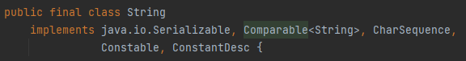
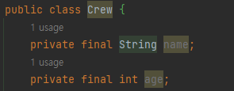

# 들어가기에 앞서
## 원시값 크기 비교
```java
public class Application {
    public static void main(String[] args) {
        int a = 1;
        int b = 2;
        System.out.println(a > b);  // false 반환
    }
}
```
## 원시값 배열 정렬
```java
public class Application {
    public static void main(String[] args) {
        int[] numbers = {2, 4, 3, 1, 6};
        Arrays.sort(numbers);
        System.out.println(Arrays.toString(numbers));   // [1, 2, 3, 4, 6] 으로 정렬
    }
}
```

## String 정렬
```java
public class Application {
    public static void main(String[] args) {
        String a = "banana";
        String b = "apple";
        List<String> fruits = new ArrayList<>();
        
        words.add(a);
        words.add(b);
        System.out.println(words);  //[banana, apple]
      
        Collections.sort(words);
        System.out.println(words);  //[apple, banana]
    }
}
```

## 혼합된 객체의 정렬
```java
public class Crew {
    private final String name;
    private final int age;
    
    public Crew(String name, int age) {
        this.name = name;
        this.age = age;
    }
}

public class Application {
    public static void main(String[] args) {
        Crew chorong = new Crew("초롱", 20);
        Crew pram = new Crew("프람", 30);
        List<Crew> crews = new ArrayList<>();
        
        crews.add(chorong);
        crews.add(pram);
        
        Collections.sort(crews);    // compile Error!
        // reason: no instance(s) of type variable(s) T exist so that EffectiveJavaTest.Crew conforms to Comparable<? super T>
    }
}
```
- `String`은 `Comparable`을 구현함   
  
- `Crew`는 `Comparable`을 구현하지 않음   
  

# Comparable이란?
## Comparable의 유일무이한 메소드 compareTo
```java
public interface Comparable<T> {
    public int compareTo(T o);
}
```
- 제네릭 <T> 자리에 비교할 타입이 들어간다.
- 구현체는 반드시 `compareTo`를 오버라이딩하여 사용한다.
- `compareTo`는 `equals`와 다르게 단순 동치성 비교에 더해 순서까지 비교할 수 있다.   
  - 따라서 `Comparable`을 구현한 객체들은 위 코드와 같이 `sort`를 사용하여 손쉽게 정렬할 수 있다.

자바의 모든 값 클래스와 열거 타입은 이미 Comparable을 구현했다.   
알파벳, 숫자, 연대 같이 순서가 명확한 값 클래스를 작성한다면 반드시 Comparable 인터페이스를 구현하자.

# compareTo 메소드의 일반 규약
- 이 객체가 주어진 객체보다 작으면 음의 정수를, 같으면 0을, 크면 양의 정수를 반환한다.
  - 일반적으로 -1, 0, 1을 반환하나 반드시 -1, 1일 필요는 없다.
- 비교할 수 없는 타입의 인스턴스가 주어지면 ClassCastException을 던진다.
- 대칭성
  - 비교의 순서가 바뀌어도 반드시 예상한 결과가 나와야 한다.
    - `x.compareTo(y)`가 예외를 던지면, `y.compareTo(x)`도 예외를 던져야 한다.
    - `x.compareTo(y) = -1 * y.compareTo(x)`
- 추이성
  - `x.compareTo(y) > 0`, `y.compareTo(z) > 0`이면 `x.compareTo(z) > 0`이다.
    - 즉, `x > y`이고, `y > z`이면 `x > z`여야 한다.
- 일관성
  - `x.compareTo(y) == 0`이면 `x.compareTo(z)`와 `y.compareTo(z)`의 값이 같다.
    - 즉, x와 y가 같다면 모든 z에 대하여 x와 y의 비교 결과는 같아야 한다.

## 권고
- `(x.compareTo(y) == 0) == (x.equals(y))`여야 한다.
  - 즉, `compareTo`로 수행한 동치성 테스트의 결과가 `equals`의 결과와 같아야 한다.
- 이 규약을 잘 지키면 `compareTo`로 줄지은 순서와 `equals`의 결과가 일관된다.
- 지키지 않는다면 컬렉션에 넣으면 해당 컬렉션이 구현한 인터페이스에 정의한 동작과 엇박자를 낼 것이다. 
  - 정렬된 컬렉션(TreeSet 등)은 동치성을 비교할때 equals가 아닌 compareTo를 사용하기 때문이다.
- 이 규약을 지키지 않은 예시 : BigDecimal
```java
public static void main(String[] args) {
    BigDecimal a = new BigDecimal("1.0");
    BigDecimal b = new BigDecimal("1.00");

    System.out.println(a.equals(b)); // false
    System.out.println(a.compareTo(b)); // 0
    System.out.println((a.compareTo(b) == 0) == a.equals(b)); // false

    Set<BigDecimal> hashSet = new HashSet<BigDecimal>();
    hashSet.add(a);
    hashSet.add(b);

    System.out.println(hashSet.size()); // 2

    Set<BigDecimal> treeSet = new TreeSet<BigDecimal>();
    treeSet.add(a);
    treeSet.add(b);

    System.out.println(treeSet.size()); // 1
}
```

## 유의사항
### 상속
- `equals`와 동일하게 기존 클래스를 확장한 구체 클래스에서 새로운 값 컴포넌트를 추가했다면 `compareTo` 규약을 지킬 방법이 없다.
  - `equals`와 동일하게 컴포지션을 사용하면 해결할 수 있다.

### 원시 타입 비교
- `compareTo` 메서드에서 관계 연산자 `<`와 `>`의 사용을 지양하고, 박싱된 기본 타입 클래스들에 새로 추가된 정적 메서드인 `compare`를 사용한다.
```java
public class Age implements Comparable<Age> {
    private final int age;
    
    /* 생략 */
  
    // 절대 지양!
    @Override
    public int compareTo(Age target) {
        if (age < target.age) {
            return -1;
        } else if (age > target.age) {
            return 1;
        }
        return 0;
    }
    
    // 절대 권장!!
    @Override
    public int compareTo(Age target) {
        return Integer.compare(age, target.age);
    }
}
```

### 필드가 여러 개인 경우
- 위에서 작성한 `Crew` 클래스와 같이 핵심 필드가 여러 개라면 어느 것을 먼저 비교하느냐가 중요해진다.
  - 가장 핵심적인 필드부터 시작하여 0이 아닌 결과가 나올 때까지 비교하자.
```java
public class Crew implements Comparable<Crew> {
    private final String name;
    private final int age;

    public Crew(String name, int age) {
        this.name = name;
        this.age = age;
    }
    
    // 나이를 기준으로, 나이가 같으면 이름을 기준으로 정렬
    @Override
    public int compareTo(Crew crew) {
        int result = Integer.compare(age, crew.age);
        if (result == 0) {
            result = name.compareTo(crew.name);
        }
        return result;
    }
}
```

### Comparator
- 자바 8에서는 `Comparator`를 사용하여 메서드 연쇄 방식으로 비교자를 생성할 수 있게 되었다.
  - 약간의 성능 저하가 뒤따른다.
```java
public class Crew implements Comparable<Crew> {
    private static final Comparator<PhoneNumber> COMPARATOR = 
            Comparator.comparingInt((Crew crew) -> crew.age)
                    .thenComparing(crew -> crew.name);
    
    /* 생략 */
  
    @Override
    public int compareTo(Crew crew) {
        return COMPARATOR.compare(this, crew);
    }
}
```
- 이 코드에서 주의해서 봐야할 점이 3번째 라인에서 람다에 입력 인수의 타입(Crew crew)를 명시한 점이다.
  - 자바의 타입 추론 능력이 이 상황에서 타입을 알아낼 만큼 강력하지 않아 직접 입력해주어야 한다.
  - 그 뒤로는 타입을 명시하지 않았는데 자바의 타입 추론 능력이 이 정도는 추론해낼 수 있기 때문이다.

### 이것만큼은 안돼
- 이따금 아래와 같이 '값의 차'를 기준으로 크기를 비교하는 경우가 있다.
```java
public class Age implements Comparable<Age> {
    private final int age;
    
    /* 생략 */
  
  @Override 
  public int compareTo(Age target) {
      return age - target.age;
  }
}
```
- 이 방식은 사용하면 안된다.
  - 정수 오버플로우를 일으키거나 IEEE 754 부동소수점 계산 방식에 따른 오류를 낼 수 있다.
  - 그렇다고 위에서 설명한 방법들보다 월등히 빠르지도 않다.

# 결론
- 순서를 고려해야 하는 값 클래스를 작성한다면 반드시 `Comparable` 인터페이스를 구현한다.
  - 이를 통해 인스턴스들을 쉽게 정렬하고, 검색하고, 비교 기능을 제공하는 컬렉션과 어우러지도록 한다.
- `compareTo` 메서드에서 필드의 값을 비교할 때 `<`와 `>` 연산자는 사용하지 않는다.
  - 대신 박싱된 기본 타입 클래스가 제공하는 정적 compare 메서드나 Comparator 인터페이스가 제공하는 비교자 생성 메서드를 사용하자.

# 부록
## IEEE 754 부동소수점 표현 방식
- IEEE 754 부동소수점 표현 방식은 컴퓨터에서 부동소수점을 표현하고 계산하는 데 사용되는 표준이다. 
- 이 표준은 부동소수점을 이진수로 표현하며, 부호, 지수, 가수로 구성된다. 
- 그러나 이 방식은 정확한 소수점 이하 값의 표현에 한계가 있기 때문에 부동소수점 연산에 오차가 발생할 수 있다.

### 주요한 오류 유형
- 반올림 오류 (Rounding Error)
  - 부동소수점을 이진수로 표현할 때 일부 소수는 정확하게 표현할 수 없다.
  - 따라서 연산 결과를 반올림해야 한다.
  - 이로 인해 정확한 결과와 약간 다른 값이 생성될 수 있다.
- 트랩 및 라운드 오버플로 (Trap and Round Overflow)
  - 연산 결과가 유효 숫자의 범위를 초과할 경우 오버플로가 발생할 수 있다.
  - 이 경우, 트랩 및 라운드 방식을 사용하여 정확한 결과를 얻을 수 없다.
- 취소 오류 (Cancellation Error)
  - 큰 값과 작은 값의 빼기 연산이 서로 상쇄될 때 발생한다.
  - 이로 인해 유효 숫자가 매우 작은 값으로 유실될 수 있다.
- 순서쌍 및 비대칭 오류 (Order Pair and Asymmetric Error)
  - 일부 부동소수점 연산은 순서쌍 또는 비대칭 오류를 초래할 수 있다. 
  - 예를 들어, 덧셈 및 뺄셈 연산은 각 항이 순서에 따라 결과에 영향을 줄 수 있다.
