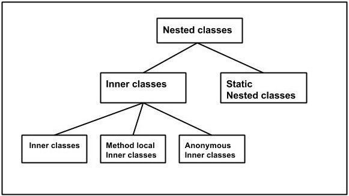
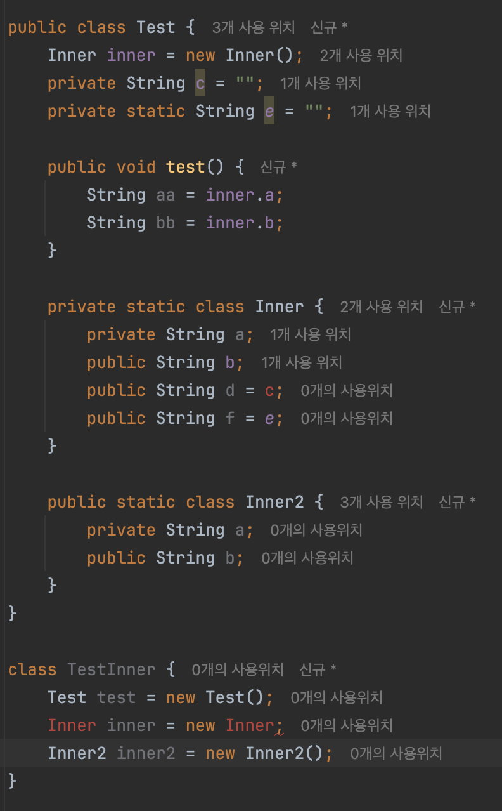
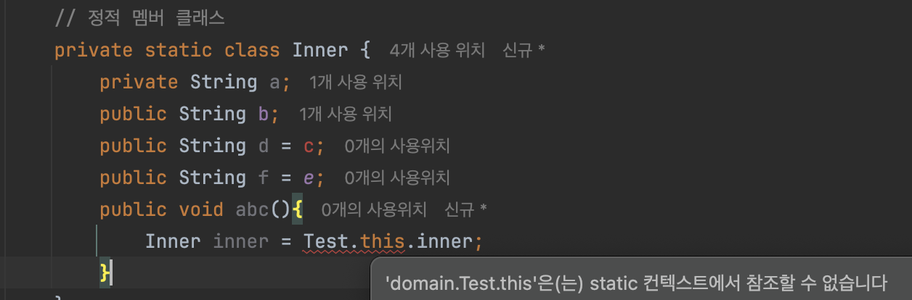
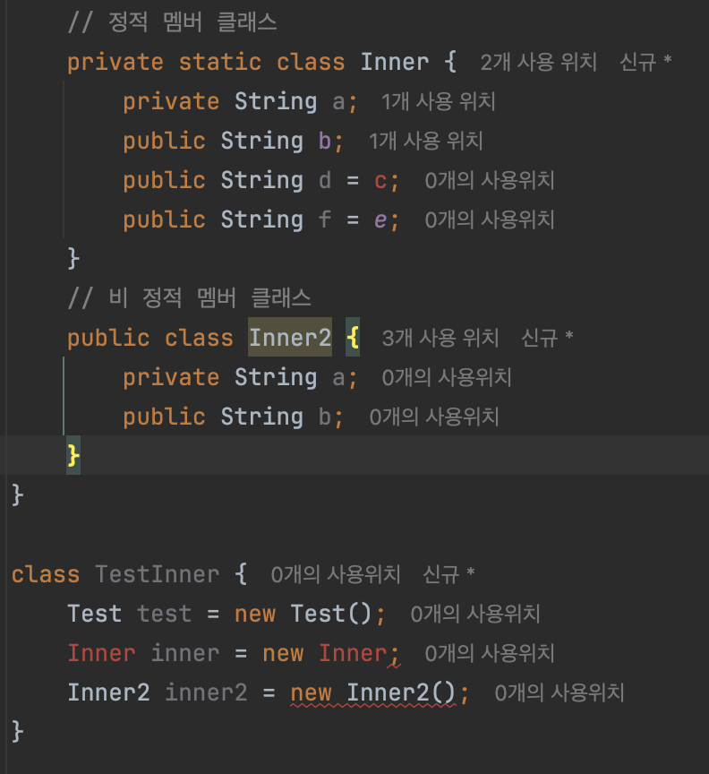
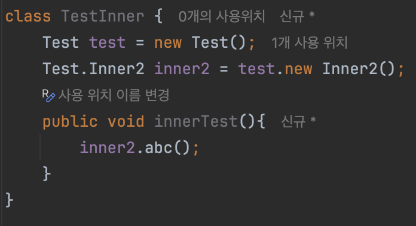

# 아이템 24 : 멤버 클래스는 되도록 static으로 만들라

**중첩 클래스**의 종류는 

- 정적 멤버 클래스
- (비정적) 멤버 클래스
- 익명 클래스
- 지역 클래스

이 중 첫번째를 제외한 나머지는 **내부클래스(inner class)** 에 해당한다



<aside>

📌 멤버 클래스는  **static** 클래스로 선언하자!

**static**이 아닌 내부 인스턴스 클래스는 외부와 연결이 되어 있어 
'외부 참조'를 갖게되어 메모리를 더 먹고, 느리며, 또한 
GC 대상에서 제외되는 여러 문제점을 일으키기 때문이다.

</aside>

## 정적 멤버 클래스

- 다른 클래스 안에 선언되고, 바깥 클래스의 `private`멤버에도 접근할 수 있다는 점만 제외하고는 일반 클래스와 똑같다
- 다른 정적 멤버와 똑같은 접근 규칙을 적용받는다
→ `private`으로 선언하면 바깥 클래스에서만 접근할 수 있는 식
    
    
    
- 열거 타입도 암시적으로 **static** 이다.

### 정적 멤버 클래스와 비정적 멤버 클래스의 차이

정적 멤버 클래스와 비정적 멤버 클래스의 구문상 차이는 단지 **static**이 붙어 있고 없고 뿐이지만, 의미상 차이는 의외로 크다

- 비정적 멤버 클래스의 인스턴스는 바깥 클래스의 인스턴스와 **암묵적**으로 연결된다.
    - 비정적 멤버 클래스의 인스턴스 메서드에서 정규화된 `this`를 사용해 바깥 인스턴스의 메서드를 호출하거나 바깥 인스턴스의 참조를 가져올 수 있다.
        
        ```java
           	// 비 정적 멤버 클래스
            public class Inner2 {
                private String a;
                public String b;
                public void abc(){
                    Inner inner = Test.this.inner;
                }
            }
        ```
        
        
        
- 비 정적 멤버 클래스는 바깥 클래스가 표현하는 객체의 한 부분(구성요소)일 때 사용

### 중첩 클래스의 인스턴스가 바깥 인스턴스와 독립적으로 존재할 수 있다면?

**→ 정적 멤버 클래스로 생성하자**

**→ 비정적 멤버 클래스는 바깥 인스턴스 없이는 생성할 수 없다.**



### 바깥 클래스가 표현하는 객체의 한 부분을 나타낼 때

**→** `private` **정적 멤버 클래스를 사용하자**

- 좋은 예시로 `Map`의 `Entry`가 있다.
    - 많은 `Map` 구현체는 각각의 `키-값` 쌍을 표현하는 엔트리 객체들을 가지고 있다.
    - 모든 엔트리가 맵과 연관되어 있지만 엔트리의 메서드들은 맵을 직접 사용하지는 않는다.

멤버 클래스가 공개된 클래스의 `public`이나 `protected` 멤버라면 정적이냐 아니냐도 중요하다

멤버 클래스 역시 공개 `API`가 되니, 혹시라도 향후 릴리스에서 `static`을 붙이면 하휘 호환성이 깨지기 때문이다.

### 비정적 멤버 클래스의 단점

비정적 멤버 클래스의 인스턴스와 바깥 인스턴스 사이의 관계는 멤버 클래스가 인스턴스화 될 때 확립되며, 더이상 변경할 수 없다.

- 이 **관계 정보**는 비정적 멤버 클래스의 인스턴스 안에 만들어져 메모리 공간을 차지하며, 생성 시간도 더 걸린다.

> **수동으로 비정적 멤버 클래스 생성 방법**
> 



### 그럼 비정적 멤버 클래스를 언제 쓸까?

- 어떤 클래스의 인스턴스를 감싸 마치 다른 클래스의 인스턴스처럼 보이게 하는 뷰로 사용
- `ex: keySet()`등이 반환 → 자신의 컬렉션 뷰를 반환
    
    ```java
    public class HashMap<K,V> extends AbstractMap<K,V>
        implements Map<K,V>, Cloneable, Serializable {
    ...
        /**
         * Returns a {@link Set} view of the keys contained in this map.
         * The set is backed by the map, so changes to the map are
         * reflected in the set, and vice-versa.  If the map is modified
         * while an iteration over the set is in progress (except through
         * the iterator's own {@code remove} operation), the results of
         * the iteration are undefined.  The set supports element removal,
         * which removes the corresponding mapping from the map, via the
         * {@code Iterator.remove}, {@code Set.remove},
         * {@code removeAll}, {@code retainAll}, and {@code clear}
         * operations.  It does not support the {@code add} or {@code addAll}
         * operations.
         *
         * @return a set view of the keys contained in this map
         */
        public Set<K> keySet() {
            Set<K> ks = keySet;
            if (ks == null) {
                ks = new KeySet();
                keySet = ks;
            }
            return ks;
        }
    ...
        
        final class KeySet extends AbstractSet<K> {
            public final int size()                 { return size; }
            public final void clear()               { HashMap.this.clear(); }
            public final Iterator<K> iterator()     { return new KeyIterator(); }
            ...
    }
    ```
    

---

### 멤버 클래스에서 바깥 인스턴스에 접근할 일이 없다면 static을 붙이자.

**static을 생략하면 바깥 인스턴스로의 숨은 외부 참조를 갖게된다
그로인해,** 

- **바깥 인스턴스 - 멤버 클래스 관계를 위한 시간과 공간 소모** (참조를 저장하려면)
- `Garbage Collection`이 바깥 클래스의 인스턴스 수거 불가 -> 메모리 누수 발생
- 참조가 눈에 보이지 않아 개발이 어려움

---

## 익명 클래스

- **이름이 없는 클래스**
- 바깥 클래스의 멤버가 아니다.
- 멤버와 달리, 쓰이는 시점에 선언과 동시에 인스턴스가 생성

### 익명 클래스의 제약 사항

- 비 정적인 문맥에서 사용될 때에만 바깥 클래스의 인스턴스를 참조할 수 있다.
    - **static으로 선언된 메소드에는 static만 접근이 가능하기 때문**
    - 정적 문맥에서라도 상수(`static final`)변수 이외의 정적 멤버는 가질 수 없다.
- 선언 지점에서만 **인스턴스 생성이 가능하며,
이름이 없기에 instanceof와 같은 검사가 불가하다.**
- **인터페이스 구현 및 다른 클래스 상속 불가**

```java
public class AnonymousClassExample {
    public static void main(String[] args) {
        // Runnable 인터페이스의 익명 클래스 구현
        Runnable r = new Runnable() {
            @Override
            public void run() {
                System.out.println("익명 클래스를 사용한 스레드 실행");
            }
        };

        Thread thread = new Thread(r);
        thread.start();
    }
}
```

**→ 람다를 지원하기 전까지는 즉석에서 작은 함수 객체나 처리 객체를 만드는 데 익명 클래스를 주로 사용했다**

**→ 이제는 람다를 사용한다.**

```java
public class LambdaExample {
    public static void main(String[] args) {
        Runnable r = () -> System.out.println("람다를 사용한 스레드 실행");
        Thread thread = new Thread(r);
        thread.start();
    }
}
```

- **정적 팩터리 메서드를 구현할 때에도 익명 클래스가 사용된다.**

```java
public class ServiceFactory {

    // 정적 팩터리 메서드: Service 인터페이스의 익명 구현체를 반환
    public static Service createService() {
        return new Service() {
            @Override
            public void execute() {
                System.out.println("Service executed.");
            }
        };
    }
}

public class Main {
    public static void main(String[] args) {
        Service service = ServiceFactory.createService();
        service.execute();
    }
}
```

---

## 지역 클래스

- 지역 변수를 선언할 수 있는 곳이면 어디서든 선언이 가능하다.
유효 범위도 지역 변수와 같다.
- 지역클래스가 비정적 멤버클래스처럼 바깥클래스를 **정규화된 `this`** 를 통해 참조가능
    
    
    

### **각 클래스와의 공통점**

- **멤버 클래스**
    - 이름이 있고, 반복해서 사용 가능
- **익명 클래스**
    - 비정적 문맥에서 사용될 때만 바깥 인스턴스 참조 가능
    - 정적 멤버를 가질 수 없음
    - 가독성을 위해 짧게 작성해야 함

---

## 결론

- **멤버 클래스 사용 경우**
    - 메소드 밖에서도 사용해야 하거나 너무 긴 경우
    - **바깥 인스턴스 참조** → 비정적으로 구성
    - **바깥 인스턴스 참조 X** → 정적으로 구성
- **익명 클래스 or 지역 클래스 사용 경우**
    - 한 메서드 안에서만 사용,
    - 인스턴스 생성 시점이 단 한 곳,
    - **해당 타입으로 쓰기 적합한 클래스나 인터페이스 이미 존재** → 익명 클래스
    - **해당 타입으로 쓰기 적합한 클래스나 인터페이스 이미 존재 X** → 지역 클래스