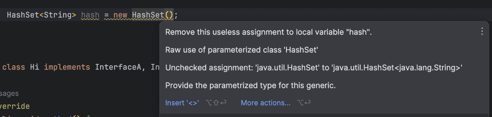

# item 27 비검사 경고를 제거하라

> 그 전에, 비검사 경고란?
> `warning : [unchecked]` 를 말하며, casting 할 때 검사를 하지 않았다고 말하는 것이다.

제네릭을 사용하면 수많은 비검사 경고가 뜬다.

비검사 경고의 예는 아래와 같다.
* 비검사 형변환 경고
* 비검사 메서드 호출 경고
* 비검사 매개변수화 가변인수 타입 경고
* 비검사 변환 경고

### 비검사 경고를 가능한 제거해야 하는 이유
비검사 경고를 제거하는 건 타입 안전성을 보장한다는 의미이기 때문이다.   
즉, ClassCastException이 발생할 일이 없는 것을 보장한다.

### @SuppressWarnings("unchecked")를 사용하자.
비검사 경고를 최대한 제거해도 남아있는 경고가 있다.   
경고는 제거할 수 없지만 타입이 안전하다는 확신이 들면 @SuppressWarnings를 사용하여 경고를 숨기자.

#### @SuppressWarnings 사용 규칙
* 타입 안전하지 않은 대상에 해당 어노테이션을 사용하지 않는다.
  * 검증이 안된 대상에 사용하는 것은 경고를 무시하는 것과 같다.
* 안전하다고 검증된 비검사 경고에는 해당 어노테이션을 꼭 사용한다.
  * 진짜 문제를 알리는 새로운 경고가 나와도 인지하기 어려워진다.
* 클래스, 필드, 메서드까지 모두 달 수 있다.
  * 그러나 항상 좁은 범위에 적용하자.
* 해당 어노테이션을 사용하면 그 경고를 무시해도 안전한 이유를 주석으로 남기자.


#### @SuppressWarnings 사용 예시
해당 어노테이션은 좁은 범위에서 사용해야 한다. 다음 예시를 보자.   
아래는 ArrayList의 toArray 메서드다.   
```java
	public <T> T[] toArray(T[] a) } {
	if(a.length < size) 
		return (T[]) Arrays.copyOf(elements, size, a.getClass());
	if(a.length > size) 
		a[size] = null;
	return a;
}
```
이 코드에서는 return 문에서 비검사 예외가 발생한다.   
하지만 타입 안전함을 보장하고 때문에 @SuppressWarnings를 어떻게 사용해야 할까?

아래 처럼 메서드 상단에 해당 어노테이션을 두면 범위가 너무 넓어진다.
```java
    @SuppressWarnings("unchecked")
	public <T> T[] toArray(T[] a) } {
	if(a.length < size) 
		return (T[]) Arrays.copyOf(elements, size, a.getClass());
	if(a.length > size) 
		a[size] = null;
	return a;
}
```

범위를 더 좁히기 위해 return문 사용하고 싶지만 어노테이션은 선언문만 가능하다.  
때문에 아래처럼 지역 변수를 선언하고 그 변수에 어노테이션을 달자.   
```java
    public <T> T[] toArray(T[] a) } {
        if(a.length < size)
            @SuppressWarnings("unchecked")
            T[] result = (T[]) Arrays.copyOf(elements, size, a.getClass());
		    return result;
	    if(a.length > size)
            a[size] = null;
        return a;
    }
```
위와 같은 코드로 깔끔하게 컴파일되고 비검사 경고도 숨길 수 있다.

