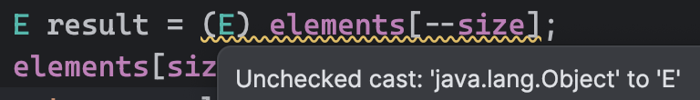

# 아이템 29 이왕이면 제네릭 타입으로 만들라

## 스택 예제

### Before

```java
import java.util.Arrays;
import java.util.EmptyStackException;

public class Stack {
    private Object[] elements;
    private int size = 0;
    private static final int DEFAULT_INITIAL_CAPACITY = 16;

    public Stack() {
        elements = new Object[DEFAULT_INITIAL_CAPACITY];
    }

    public void push(Object e) {
        ensureCapacity();
        elements[size++] = e;
    }

    public Object pop() {
        if (size == 0) {
            throw new EmptyStackException();
        }
        Object result = elements[--size];
        elements[size] = null;
        return result;
    }

    public boolean isEmpty() {
        return size == 0;
    }

    private void ensureCapacity() {
        if (elements.length == size) {
            elements = Arrays.copyOf(elements, 2 * size + 1);
        }
    }
}
```

### After

```java
import java.util.EmptyStackException;

public class Stack<E> {
    private E[] elements;
    private int size = 0;
    private static final int DEFAULT_INITIAL_CAPACITY = 16;

    public Stack() {
        elements = new E[DEFAULT_INITIAL_CAPACITY];
    }

    public void push(E e) {
        ensureCapacity();
        elements[size++] = e;
    }

    public E pop() {
        if (size == 0) {
            throw new EmptyStackException();
        }
        E result = elements[--size];
        elements[size] = null;
        return result;
    }
    
    // ensureCapacity() 메서드 생략
}
```


E는 타입 파라미터이므로 new 키워드 뒤에 사용할 수 없다. 

즉, E가 결정되지 않았으므로 인스턴스화할 수 없다.


직접 형변환하면 경고를 띄운다.

그러나 push 메서드를 통해 배열에 저장되는 원소의 타입은 항상 E라는 것이 보장된다.

그러므로 위 형변환은 안전하다. 


타입 안전이 확보되었으므로 `@SuppressWarnings` 애너테이션으로 경고를 숨기자.  

---

제네릭 배열 생성 오류를 해결하는 이런 방법도 있다.

```java
// Before
private E[] elements;

// After
private Object[] elements;
```

인스턴스 변수의 타입을 `Object[]`로 바꾸면 다음의 에러가 발생하는데,  


직접 형변환하면 된다. 그러면 경고만 뜬다. 



## 추가자료


## 요약

형변환하지 말고 제네릭 타입을 써라.
