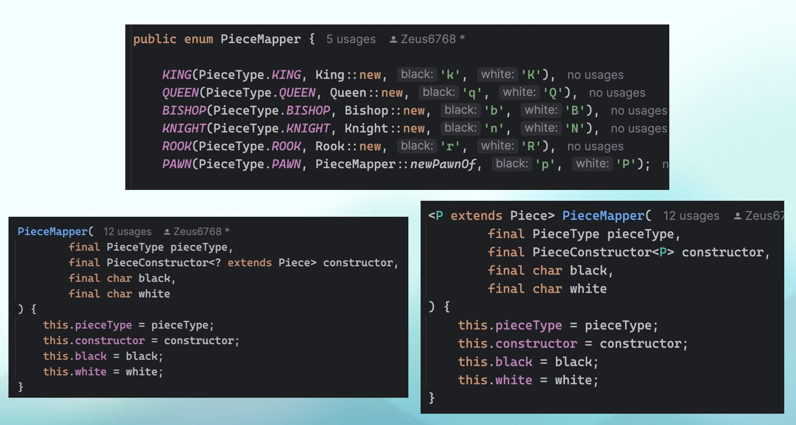

# 아이템 30 이왕이면 제네릭 메서드로 만들라

## Set union() 정적 메서드 예제

### Before

```java
import java.util.HashSet;

public static Set union(Set s1, Set s2) {
    Set result = new HashSet(s1);
    result.addAll(s2);
    return result;
}
```

### After

```java
import java.util.HashSet;

public static <E> Set<E> union(Set<E> s1, Set<E> s2) {
    Set<E> result = new HashSet<>();
    result.addAll(s2);
    return result;
}
```

### 제네릭 싱글턴 팩터리 패턴

```java
private static UnaryOperator<Object> IDENTITY_FUNCTION = o -> o;
    
public static <T> UnaryOperator<T> identityFunction() {
    return (UnaryOperator<T>) IDENTITY_FUNCTION;
}
```

비검사 형변환 경고가 발생한다. 그러나 안전하다. 실제로 사용하면 다음과 같다. 

```java
public static void main(String[] args) {
    String[] strings = {"삼베", "대마", "나일론"};
    UnaryOperator<String> sameString = identityFunction();
    for (String s : strings) {
        System.out.println(sameString.apply(s));
    }
    
    Number[] numbers = {1, 2.0, 3L};
    UnaryOperator<Number> sameNumber = identityFunction();
    for (Number n : numbers) {
        System.out.println(sameNumber.apply(n));
    }
}
```

사용할 땐 어떤 경고나 에러도 발생하지 않는다.

## 재귀적 타입 한정

```java
public static <E extends Comparable<E>> E max(Collection<E> c);
```

"모든 타입 E는 자신과 비교할 수 있다."

-> 타입 E의 인스턴스들은 서로 비교할 수 있다.

## 생각해볼만한 주제

생성자를 제네릭 메서드로 선언 vs 파라미터에 와일드카드 사용



## 요약

형변환하지 말고 제네릭 메서드로 만들라.
