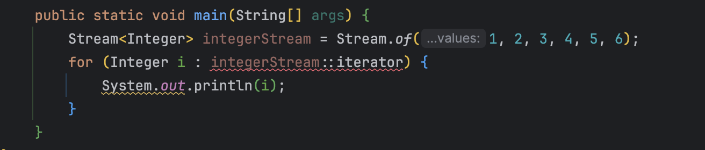

# [item 47] 반환 타입으로는 스트림보다 컬렉션이 낫다.

### 스트림은 반복을 지원하지 않는다.
아래 예시를 보자.
```java
Stream<Integer> integerStream = Stream.of(1, 2, 3, 4, 5, 6);
for (Integer i : integerStream::iterator) {
    System.out.println(i);
}
```
Stream은 iterator를 참조하기 때문에 이를 사용해서 for-each 문을 사용할 수 있을 것 같지만, 아래와 같이 오류가 발생한다.


이를 해결하기 위해서는 형변환이 필요하다.
```java
Stream<Integer> integerStream = Stream.of(1, 2, 3, 4, 5, 6);
for (Integer i : (Iterable<Integer>) integerStream::iterator) {
    System.out.println(i);
}
```
이런 형변환은 번거롭고 직관성이 떨어진다.  
때문에 공개 API를 구현할 때는 iterable과 stream을 모두 반환할 수 있도록 만들자.

### Collection을 사용해야 하는 이유
자바에서도 모두 반환하는 예시가 있다. 그것이 바로 Collection이다.   
Collection 인터페이스는 iterable의 하위 타입이고 stream 메서드도 제공한다.   
즉, 반복과 스트림을 동시에 지원한다.    
때문에 원소 시퀀스를 반환하는 공개 API 반환 타입에는 Collection이나 그 하위 타입을 쓰는 것이 일반적으로 최선이다.


### stream과 iterable을 모두 제공하는 API를 만드는 법 - 어댑터 사용
이전에 봤던 코드를 다시 보자.
```java
Stream<Integer> integerStream = Stream.of(1, 2, 3, 4, 5, 6);
for (Integer i : (Iterable<Integer>) integerStream::iterator) {
    System.out.println(i);
}
```
이 코드는 직관성이 떨어지고 형변환을 해줘야 하는 번거로움이 있다.

이를 해결하기 위해서, Stream을 Iterable로 만들어 주는 어댑터를 만들 수 있다.
```java
public static <E> Iterable<E> iterableOf(Stream<E> stream) {
    return stream::iterator;
}
 
Stream<Integer> integerStream = Stream.of(1, 2, 3, 4, 5, 6);
for (Integer i : iterableOf(integerStream)) { // iterableOf 어댑터 사용
    System.out.println(i);
}
```

만약 Iterable을 Stream으로 바꿔주고 싶으면 어떻게 할까?   
이 또한 어댑터를 만들어주면 된다.
```java
public static <E> Stream<E> streamOf(Iterable<E> iterable) {
	return StreamSupport.stream(iterable.spliterator(), false);
}

List<Integer> integers = List.of(1, 2, 3, 4, 5); // 스트림 사용
streamOf(integers).filter(integer -> integer == 1).collect(Collectors.toSet());
```

### Collection의 원소들을 다 올리기엔 너무 원소의 크기가 크다면?
전용 컬렉션을 구현하는 방안을 생각해보자!

**예1) 집합의 멱집합을 구해서 컬렉션으로 반환하는 경우**
> 멱집합 : 집합의 부분집합을 원소로 갖는 집합 {1,2} -> {공집합, {1}, {2}, {1,2}}

집합의 원소가 n개이면 멱집합의 원소의 개수는 2^n이다. 때문에 멱집합을 표준 컬렉션 구현체에 저장하는 생각은 위험하다.   
때문에 아래처럼 각 원소의 인덱스를 비트 벡터로 사용하는 전용 컬렉션 구현체를 만들 수 있다.
```java
public class PowerSet {
    public static final <E> Collection<Set<E>> of(Set<E> s) {
        List<E> src = new ArrayList<>(s);
        if (src.size() > 30)
            throw new IllegalArgumentException(
                "집합에 원소가 너무 많습니다(최대 30개).: " + s);
                
        return new AbstractList<Set<E>>() {
            @Override public int size() {
                // 멱집합의 크기는 2를 원래 집합의 원소 수만큼 거듭제곱 것과 같다.
                return 1 << src.size();
            }

            @Override public boolean contains(Object o) {
                return o instanceof Set && src.containsAll((Set)o);
            }

			// 인덱스 n 번째 비트 값 : 해당 원소가 원래 집합의 n 번째 원소를 포함하는지 여부
            @Override public Set<E> get(int index) {
                Set<E> result = new HashSet<>();
                for (int i = 0; index != 0; i++, index >>= 1)
                    if ((index & 1) == 1)
                        result.add(src.get(i));
                return result;
            }
        };
    }
}
```

**예2) 입력 리스트의 모든 부분 리스트 반환하는 경우**   
아래와 같이 이중 포문을 사용할 수 있지만, n^2의 시간 복잡도가 발생한다. 이는 메모리 차지가 발생한다.
```java
for (int start = 0; start < src.size(); start++) {
	for (int end = start + 1; end <= src.size(); end++) {
    	System.out.println(src.subList(start, end));
    }
}
```

컬렉션 대신, 스트림을 반환하면 다음과 같다.
```java
public class SubLists {
    // 컬렉션 대신, 스트림을 반환
    public static <E> Stream<List<E>> of(List<E> list) { //(a, b, c)
        return Stream.concat(Stream.of(Collections.emptyList()),
                prefixes(list).flatMap(SubLists::suffixes));
    }

    private static <E> Stream<List<E>> prefixes(List<E> list) { // (a), (a,b), (a,b,c)
        return IntStream.rangeClosed(1, list.size())
                .mapToObj(end -> list.subList(0, end));
    }

    private static <E> Stream<List<E>> suffixes(List<E> list) { // (a,b,c), (b,c), (c)
        return IntStream.range(0, list.size())
                .mapToObj(start -> list.subList(start, list.size()));
    }
}
```

### 결론
> 반환 전부터 이미 원소들을 컬렉션에 담아 관리하고 있거나 원소 개수가 적다 -> 표준 컬렉션    
> 원소들이 너무 많아서 관리가 어렵다면 -> 전용 컬렉션을 구현할 수도 있다.    
> 컬렉션 반환이 불가능 하다면 -> stream 또는 Iterable   
> 되도록이면, API는 stream과 iterable을 반환하도록 하자   
