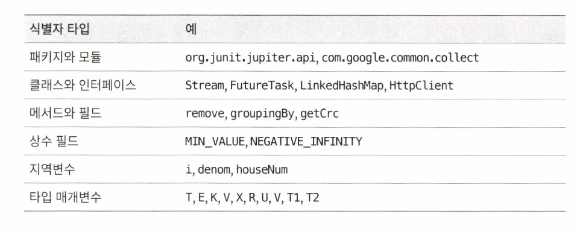

# 아이템 51: 메서드 시그니처를 신중히 설계하라

다음은 **API 설계 요령**들을 모아 놓은 것이다.

이 요령들을 잘 활용하면 배우기 쉽고, 쓰기 쉬우며, 오류 가능성이 적은 `API`를 만들 수 있을 것이다.

## 메서드 이름을 신중히 짓자.

- **항상 표준 명명 규칙(아이템 68)을 따라야 한다.**
  이해할 수 있고, 같은 패키지에 속한 다른 이름들과 일관되게 짓는 게 최우선 목표다.

  

- 그 다음 목표는 개발자 커뮤니티에서 널리 받아들여지는 이름을 사용하는 것
- 긴 이름은 피하도록 한다.
  애매하면 자바 라이브러리의 API 가이드를 참조하도록 한다. 대부분은 납득할만한 수준이다.

## 편의 메서드를 너무 많이 만들지 말자.

- `편의메서드 = 말 그대로 편의를 위한 메서드`
    - **`Collections.sort`**, **`Collections.reverse`**, **`Collections.shuffle`** 과 같은 메서드들이 편의 메서드
- 메서드가 너무 많은 클래스는 익히고, 사용하고, 문서화하고, 테스트하고, 유지보수하기 어렵다. 인터페이스도 마찬가지다.

    ```java
    public class HelperUtils {
        // 너무 많은 헬퍼 메서드가 포함된 클래스
        public static int add(int a, int b) {
            return a + b;
        }
    
        public static int subtract(int a, int b) {
            return a - b;
        }
    
        public static int multiply(int a, int b) {
            return a * b;
        }
    
        public static int divide(int a, int b) {
            if (b == 0) {
                throw new ArithmeticException("Division by zero");
            }
            return a / b;
        }
    
        public static boolean isEmpty(String str) {
            return str == null || str.isEmpty();
        }
    
        public static boolean isNotEmpty(String str) {
            return !isEmpty(str);
        }
    
        public static String join(String delimiter, String... elements) {
            return String.join(delimiter, elements);
        }
    
        public static String reverse(String str) {
            return new StringBuilder(str).reverse().toString();
        }
    
        public static String toUpperCase(String str) {
            return str.toUpperCase();
        }
    
        public static String toLowerCase(String str) {
            return str.toLowerCase();
        }
    
        public static boolean contains(String str, String substring) {
            return str != null && str.contains(substring);
        }
    
        // ... 더 많은 헬퍼 메서드가 있을 수 있음
    }
    
    // <문제점>
    
    // 헬퍼 클래스의 남용: 하나의 클래스에 너무 많은 기능이 집중되어 있습니다. 이는 클래스의 책임을 불명확하게 하고, 코드의 응집도를 낮춥니다.
    // 의미 없는 추상화: 기본적인 문자열 조작이나 산술 연산을 위한 편의 메서드가 과도하게 포함되어 있습니다. 이런 메서드들은 자바의 기본 라이브러리에서 쉽게 사용할 수 있습니다.
    // 코드 가독성 저하: 메서드가 너무 많아져 어떤 기능을 수행하는지 파악하기 어렵다
    ```

- 클래스나 인터페이스는 자신의 각 기능을 완벽히 수행하는 메서드로 제공해야 한다.
- 아주 자주 쓰일 경우에만 별도의 약칭 메서드를 두도록 한다. 
**확신이 서지 않으면 만들지 않도록 한다.**

    ```java
    // 약칭 메서드: 다양한 데이터 타입에 대해 동일한 이름의 메서드 제공
            assertEquals(expected, actual);
            assertEquals("Test String", "Test " + "String");
            assertEquals(0.5, 0.5, 0.0);
    ```


## 매개변수 목록은 짧게 유지하자.

- 4개 이하가 좋다. 일단 4개가 넘어가면 매개변수를 전부 기억하기가 쉽지 않다.
- **같은 타입의 매개변수 여러 개가 연달아 나오는 경우가 특히 해롭다.**
    - 사용자가 매개변수 순서를 기억하기도 어렵고, 실수로 순서를 바꿔 입력해도 그대로 컴파일되고 실행된다. 그리고, 의도와 다르게 동작한다.

    ```java
    public record ReservationRequest(LocalDate date, long timeId, long themeId) {
    ...
    }
    
    long timeId = 1;
    long themeId = 2;
    LocalDate date = LocalDate.now();
    
    new ReservationRequest(date, themeId, timeId); // <- 문제없이 컴파일 된다.
    ```


### 과하게 긴 매개변수 목록을 짧게 줄여주는 기술

- 첫 번째. 여러 메서드로 쪼갠다.
    - 쪼개진 메서드 각각은 원래 매개변수 목록의 부분집합을 받는다.

        <aside>
      
        📌 `List` 인터페이스가 좋은 예시

        - 전체 리스트가 아닌 지정된 범위의 부분리스트에서 주어진 원소의 인덱스를 찾아야 한다고 가정했을 때
        - 이 기능을 하나의 메서드로 구현하려면 `부분 리스트의 시작`, `부분 리스트의 끝`, `찾을 원소` 총 3개의 매개변수가 필요
        - 하지만 `List`는 부분리스트를 반환하는 `subList` 메서드와 주어진 원소의 인덱스를 알려주는 `indexOf`메서드를 별개로 제공하므로써
          두 메서드를 조합하여 원하는 목적을 달성할 수 있다.
        </aside>

    - 잘못하면 메서드가 너무 많아질 수 있지만, **직교성(orthohonality)** 을 높여 오히려 메서드 수를 줄여주는 효과도 있다.

> **"직교성이 높다"라고 하면 "공통점이 없는 기능들이 잘 분리되어 있다" 혹은 "기능을 원자적으로 쪼개 제공한다" 정도로 해석할 수 있다.**
>
>
> 기능을 원자적으로 쪼개다 보면, 자연스럽게 중복이 줄고 결합성이 낮아져 코드를 수정하기 수월해지며 **테스트하기 쉬워진다.**
>
> - 앞서 살펴본 `subList`와 `indexOf`도 서로 관련이 없으므로 두 기능을 개별 메서드로 제공해야 직교성이 높다고 할 수 있다.
>
> 일반적으로 직교성이 높은 설계는 가볍고 구현하기 쉽고 유연하고 강력하다. 단, **API가 다루는 개념의 추상화 수준에 맞게 조절해야 한다.**
>
> - **높은 추상화**
    >     - 복잡한 세부 사항을 숨기고 사용자에게 간단한 인터페이스를 제공
>     - **Collections API는 높은 추상화를 제공해 아래의 메서드를 제공한다.**
        >         - 리스트를 정렬하거나 섞는 작업을 수행할 때 **`Collections.sort()`**나 **`Collections.shuffle()`** 메서드
> - **낮은 추상화**
    >     - 사용자가 더 많은 세부 사항을 직접 관리하고 제어할 수 있도록 구성하는 것
>
> 또한 특정 조합의 패턴이 상당히 자주 사용되거나 최적화하여 성능을 크게 개선할 수 있다면 직교성이 낮아지더라도 편의 기능으로 제공하는 편이 나을 수도 있다.
>
- 두 번째. 매개변수 여러 개를 묶어주는 **도우미 클래스**를 만든다.
    - 일반적으로 이런 도우미 클래스는 정적 멤버 클래스로 둔다.

    ```java
    public class FileTransfer {
        // 도우미 클래스를 정적 멤버 클래스로 선언
        public static class FileTransferParams {
            private String fileName;
            private long fileSize;
            private double transferSpeed;
    
            public FileTransferParams(String fileName, long fileSize, double transferSpeed) {
                this.fileName = fileName;
                this.fileSize = fileSize;
                this.transferSpeed = transferSpeed;
            }
    
            // getter 메서드
            public String getFileName() {
                return fileName;
            }
    
            public long getFileSize() {
                return fileSize;
            }
    
            public double getTransferSpeed() {
                return transferSpeed;
            }
        }
    
        // 파일 전송 메서드
        public void transferFile(FileTransferParams params) {
            System.out.println("Transferring file: " + params.getFileName());
            System.out.println("File size: " + params.getFileSize() + " bytes");
            System.out.println("Transfer speed: " + params.getTransferSpeed() + " MB/s");
            // 실제 파일 전송 로직은 여기에 구현
        }
    
        public static void main(String[] args) {
            // 도우미 클래스의 인스턴스를 생성하여 매개변수를 묶음
            FileTransferParams params = new FileTransferParams("example.txt", 1024, 10.5);
    
            // 파일 전송 객체를 생성하여 파일을 전송
            FileTransfer fileTransfer = new FileTransfer();
            fileTransfer.transferFile(params);
        }
    }
    
    ```

- 세 번째. 객체 생성에 사용한 **빌더 패턴**을 메서드 호출에 응용한다.
    - 이 기법은 매개변수가 많을 때, 특히 그중 일부는 생략해도 괜찮을 때 도움이 된다.
    - 먼저 모든 매개변수를 하나로 추상화한 객체를 정의하고, 클라이언트에서 이 객체의 세터(setter) 메서드를 호출해 필요한 값을 설정하게 한다.
    - 이때 각 세터 메서드는 매개변수 하나 혹은 서로 연관된 몇 개만 설정하게 한다.
    - 클라이언트는 먼저 필요한 매개변수를 다 설정한 다음, 앞서 설정한 매개변수들의 유효성을 검사한다.
    - 마지막으로, 설정이 완료된 객체를 넘겨 원하는 계산을 수행한다.

        ```java
        public class User {
            private String name;
            private String email;
            private String phoneNumber;
            private String address;
            private int age;
        
            private User(Builder builder) {
        			  validateName(builder.name);
                this.name = builder.name;
                this.email = builder.email;
                this.phoneNumber = builder.phoneNumber;
                this.address = builder.address;
                this.age = builder.age;
            }
            
        		private void validateName(String name){
        		...
        		} // 유효성 검사
        
            public static class Builder {
                private final String name;
                private final String email;
                private String phoneNumber;
                private String address;
                private int age;
        
                public Builder(String name, String email) {
                    this.name = name;
                    this.email = email;
                }
        
                public Builder phoneNumber(String phoneNumber) {
                    this.phoneNumber = phoneNumber;
                    return this;
                }
        
                public Builder address(String address) {
                    this.address = address;
                    return this;
                }
        
                public Builder age(int age) {
                    this.age = age;
                    return this;
                }
        
                public User build() {
                    return new User(this);
                }
            }
        
            @Override
            public String toString() {
                return "User{name='" + name + "', email='" + email + "', phoneNumber='" + phoneNumber + "', address='" + address + "', age=" + age + "}";
            }
        }
        
        ...
        
        public static void main(String[] args) {
                UserRegistration registration = new UserRegistration();
                
                // 빌더 패턴을 사용하여 User 객체 생성
                User user = new User.Builder("John Doe", "john.doe@example.com")
                        .phoneNumber("123-456-7890")
                        .address("123 Main St")
                        .age(30)
                        .build();
        
                // 사용자 등록
                registration.registerUser(user);
            }
        
        ```


## 매개변수의 타입으로는 클래스보다는 인터페이스가 더 낫다.

- 매개변수로 적합한 인터페이스가 있다면 (이를 구현한 클래스가 아닌) 그 인터페이스를 직접 사용하도록 한다.
    - `ex:` 메서드에 `HashMap`을 넘길 일은 전혀 없다. 대신 `Map`을 사용한다. 그러면 다른 `Map` 구현체도 인수로 건넬 수 있다.
- 인터페이스 대신 클래스를 사용하면 클라이언트에게 특정 구현체만 사용하도록 제한하는 꼴이며,
  혹시라도 입력 데이터가 **다른 형태로 존재한다면 명시한 특정 구현체의 객체로 옮겨 담느라 비싼 복사 비용을 치러야 한다.**

## boolean보다는 원소 2개짜리 열거 타입(enum)이 낫다.

- (단, 메서드 이름상 `boolean`을 받아야 의미가 더 명확할 때는 예외다.)
- 열거 타입을 사용하면 코드를 읽고 쓰기가 더 쉬워지며, 나중에 선택지를 추가하기도 쉽다.
- 열거 타입을 사용하면 개별 열거 타입 상수 각각에 특정 동작을 수행하는 메서드를 정의해둘 수도 있다.

```java
public enum TemperatureScale {
    CELSIUS,
    FAHRENHEIT;
}

Thermometer.newInstance(true) -> 명확하지 않음
Thermometer.newInstance(TemperatureScale.FAHRENHEIT) -> 명확
```
