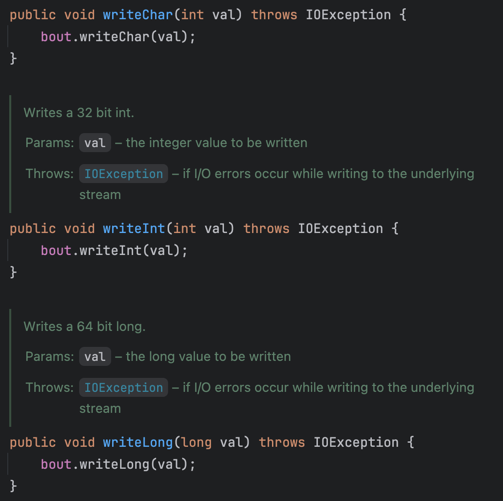
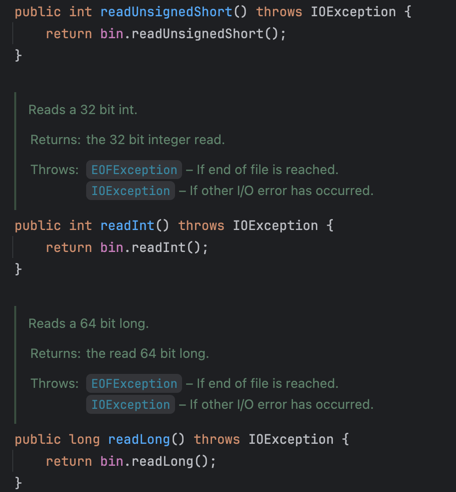
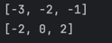

# 다중정의(오버로딩)는 신중히 사용하라.
- 아래의 코드를 보고 무엇을 출력할 지 예상해보자.
```java
class Wine {
    String name() { 
        return "포도주"; 
    }
}

class SparklingWine extends Wine {
    @Override 
    String name() { 
        return "발포성 포도주"; 
    }
}

class Champagne extends SparklingWine {
    @Override 
    String name() { 
        return "샴페인"; 
    }
}

public class Overriding {
    public static void main(String[] args) {
        List<Wine> wineList = List.of(
                new Wine(), new SparklingWine(), new Champagne());

        for (Wine wine : wineList)
            System.out.println(wine.name());
    }
}
```
- `"포도주", "발포성 포도주", "샴페인"`


- 이 코드는 어떨까?
```java
public class CollectionClassifier {
    public static String classify(Set<?> s) {
        return "집합";
    }

    public static String classify(List<?> lst) {
        return "리스트";
    }

    public static String classify(Collection<?> c) {
        return "그 외";
    }

    public static void main(String[] args) {
        Collection<?>[] collections = {
                new HashSet<String>(),
                new ArrayList<BigInteger>(),
                new HashMap<String, String>().values()
        };

        for (Collection<?> c : collections)
            System.out.println(classify(c));
    }
}
```

- `"집합", "리스트", "그 외"`를 차례로 출력할 것 같지만, 실제로는 `"그 외, "그 외", "그 외"`가 출력된다.

## 메서드 재정의(오버라이딩)과 다중정의(오버로딩)
### 재정의(오버라이딩)
- 해당 객체의 런타임 타입이 어떤 메서드를 호출할지의 기준이 된다.
- 메서드를 재정의한 다음 '하위 클래스의 인스턴스'에서 그 메서드를 호출하면 재정의한 메서드가 실행된다.
  - 컴파일 타임에 그 인스턴스의 타입이 무엇이었냐는 상관없다.

### 다중정의(오버로딩)
- 어느 메서드를 호출할지가 컴파일타임에 정해진다.
- 컴파일타임에는 for문 안의 c는 항상 Collection<?> 타입이다.
- 런타임에는 타입이 매번 달라지지만, 호출할 메서드를 선택하는 데는 영향을 주지 못하낟.
- 따라서 컴파일타임의 매개변수 타입을 기준으로 항상 세 번째 메서드인 `classify(Collection<?>)`만 호출하게 된다.
- 위 문제를 해결하려면 다음과 같이 모든 `classify` 메서드를 하나로 합친 후 `instanceof`로 명시적으로 검사하면 된다.
```java
public static String classify(Collection<?> c) {
    if(c instanceof Set) {
        return "집합";
    }
    if(c instanceof List) {
      return "리스트";
    }
    return "그 외";
}
```
- 매개변수가 같은 다중정의는 만들지 말자.
- 가장 간단한 방법은 메서드 이름을 다르게 지어주는 것이다.

## 좋은 예시
- `ObjectOutputStream` 클래스를 살펴보면 모든 `write` 메서드에 다른 이름을 지어주었다.

- 이 방식의 장점은 `read` 메서드의 이름과 짝을 맞추기 좋다는 것이다.
- 실제로 `ObjectInputStream` 클래스의 `read` 메서드는 다음과 같이 되어 있다.


## 생성자
- 생성자는 이름을 다르게 지을 수 없어 무조건 다중정의가 된다.
- 이 경우는 매개변수 중 하나 이상이 "근본적으로 다르다"면 된다.
  - 근본적으로 다르다는 것은 두 타입의 값이 서로 어느 쪽으로든 형변환할 수 없다는 뜻이다.
- 이 조건만 충족하면 어느 다중정의 메서드를 호출할지가 매개변수들의 런타임 타입만으로 결정된다.
```java
public class ArrayList<E> extends AbstractList<E>
        implements List<E>, RandomAccess, Cloneable, java.io.Serializable {
    public ArrayList(int initialCapacity) {
        if (initialCapacity > 0) {
            this.elementData = new Object[initialCapacity];
        } else if (initialCapacity == 0) {
            this.elementData = EMPTY_ELEMENTDATA;
        } else {
            throw new IllegalArgumentException("Illegal Capacity: " +
                    initialCapacity);
        }
    }

    public ArrayList(Collection<? extends E> c) {
        Object[] a = c.toArray();
        if ((size = a.length) != 0) {
            if (c.getClass() == ArrayList.class) {
                elementData = a;
            } else {
                elementData = Arrays.copyOf(a, size, Object[].class);
            }
        } else {
            // replace with empty array.
            elementData = EMPTY_ELEMENTDATA;
        }
    }
}
```

## 다중정의가 위험한 또다른 이유
### 제네릭과 오토박싱
```java
public class SetList {
    public static void main(String[] args) {
        Set<Integer> set = new TreeSet<>();
        List<Integer> list = new ArrayList<>();

        for (int i = -3; i < 3; i++) {
            set.add(i);
            list.add(i);
        }

        for (int i = 0; i < 3; i++) {
            set.remove(i);
            list.remove(i);
        }

        System.out.println(set);
        System.out.println(list);
    }
}
```


- `set.remove(i)`의 시그니처는 `remove(Object)`이다.
- `list.remove(i)`는 다중정의된 `remove(int index)`를 선택한다.
  - 이 `remove`는 '지정한 위치'의 원소를 제거한다.
- 이 문제를 해결하려면 `list.remove`의 인수를 `Integer`로 형변환하면 된다.
- 이러한 문제는 제네릭과 오토박싱이 등장하면서 두 메서드의 매개변수 타입이 근본적으로 다르지 않게 됐기 때문에 발생한 문제이다.

## 결론
- 일반적으로 매개변수 수가 같을 때는 다중정의를 피하라.
- 피할 수 없는 경우 형변환을 통해 정확한 다중정의 메서드가 선택되도록 한다.