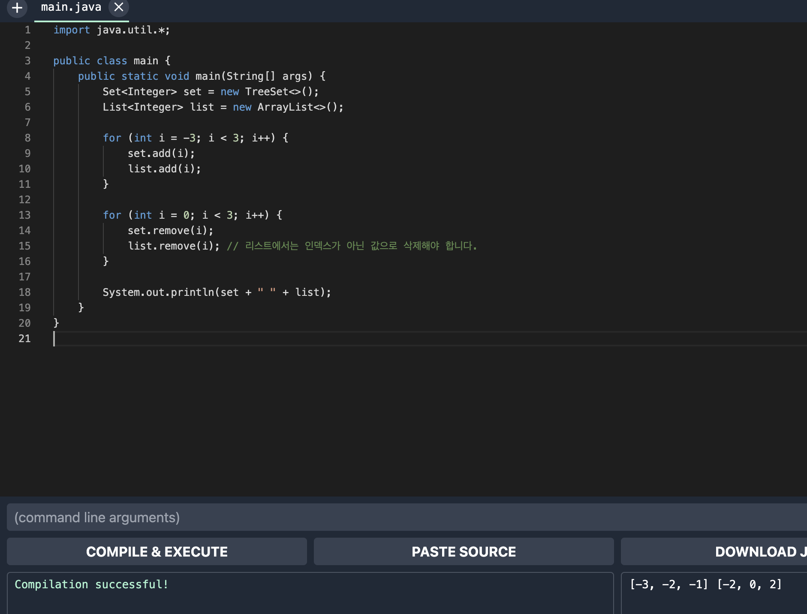
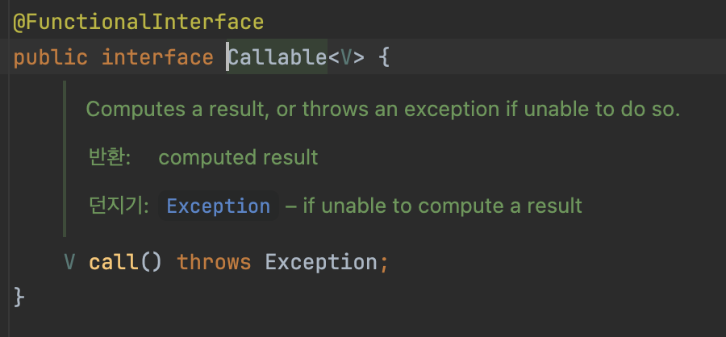

# 아이템 52: 다중정의는 신중히 사용하라

```java
import java.math.BigInteger;
import java.util.*;

public class CollectionClassifier {
    public static String classify(Set<?> s) {
        return "집합";
    }

    public static String classify(List<?> lst) {
        return "리스트";
    }

    public static String classify(Collection<?> c) {
        return "그외";
    }

    public static void main(String[] args) {
        Collection<?>[] collections = {
            new HashSet<String>(),
            new ArrayList<BigInteger>(),
            new HashMap<String, String>().values()
        };

        for (Collection<?> c : collections) {
            System.out.println(classify(c));
        }
    }
}
```

### 어떻게 출력될까?

**집합**, **리스트**, **그 외** 를 차례로 출력할 것 같지만,

실제로 수행해보면 **그외**만 세번 출력한다

### 이유가 뭐지?

다중정의(오버로딩)된 세 `classify` 중 **어느 메서드를 호출할지가 컴파일타임**에 정해지기 때문이다.

컴파일 타임에는 `for`문 안의 `c`는 항상 `Collection<?>` 타입이다.

### 런타임에는 타입이 매번 달라지지만,
**호출할 메서드를 선택하는 데는 영향을 주지 못한다.**

> 자바에서 메서드 **오버로딩**은 컴파일 타임에 결정.
즉, 컴파일러가 각 메서드 호출을 분석하여 적절한 메서드를 선택한다.
런타임에는 이미 컴파일러가 정한 대로 호출될 메서드가 결정되어 있다

**메서드 오버로딩**

컴파일 타임에 메서드 오버로딩은 메서드 시그니처(메서드 이름과 매개변수 타입)에 따라 어떤 메서드가 호출될지를 결정합니다.
따라서 컴파일된 바이트코드에는 이미 어떤 메서드가 호출될지가 명확하게 포함되어 있습니다.

**제네릭 타입 소거**

제네릭 타입은 컴파일 타임에만 사용되고, 런타임에는 제거됩니다. 이를 타입 소거(type erasure)라고 합니다. 컴파일러는 제네릭 타입을 제거하고, 대신 적절한 구체 타입으로 대체하거나 형변환 코드를 추가합니다.


**실제 런타임에서의 변환**

```java
import java.math.BigInteger;
import java.util.*;

public class CollectionClassifier {
    public static String classify(Set s) {
        return "집합";
    }

    public static String classify(List lst) {
        return "리스트";
    }

    public static String classify(Collection c) {
        return "그외";
    }

    public static void main(String[] args) {
        Collection[] collections = {
            new HashSet(),
            new ArrayList(),
            new HashMap().values()
        };

        for (Collection c : collections) {
            System.out.println(classify(c));
        }
    }
}

```

이처럼 직관과 어긋나는 이유는
**재정의한 메서드는 `동적`으로 선택되고,**
**다중 정의한 메서드는 `정적`으로 선택되기 때문이다.**

### 만약 메서드를 재정의 했다면?

해당 객체의 런타임 타입이 **어떤 메서드**를 호출할지의 기준이 된다.

메서드를 재정의한 다음 **하위 클래스의 인스턴스에서 그 메서드를 호출하면 재정의한 메서드가 실행된다.**

컴파일 타임에 그 인스턴스의 타입이 무엇이었냐는 상관없다.

```java
import java.util.List;

class Wine {
    String name() {
        return "포도주";
    }
}

class SparklingWine extends Wine {
    @Override
    String name() {
        return "발포성 포도주";
    }
}

class Champagne extends SparklingWine {
    @Override
    String name() {
        return "샴페인";
    }
}

public class Overriding {
    public static void main(String[] args) {
        List<Wine> wineList = List.of(
            new Wine(), 
            new SparklingWine(), 
            new Champagne()
        );
        
        for (Wine wine : wineList) {
            System.out.println(wine.name());
        }
    }
}
```

### 어떻게 출력될까?

예상대로 **포도주, 발포성 포도주, 샴페인**을 차례로 출력한다.

### 이유가 뭐지?

`for` 문에서의 컴파일 타입이 모두 `Wine` 인 것에 무관하게 항상 가장 하위에서 정의한 재정의 메서드가 실행되기 때문에

다중 정의(오버로딩)된 메서드 사이에서는 객체의 **런타임 타입**은 전혀 중요하지 않다!!
선택은 컴파일 타임에 오직 매개변수의 컴파일 타임 타입에 의해 이루어진다. → **`정적`**

<aside>

📌 **즉 재정의한 메서드는 프로그래머가 기대한 대로 동작하지만,
다중정의한 메서드는 이러한 기대를 가볍게 무시한다
→ 다중정의가 혼동을 일으키는 상황을 피하자!**

</aside>

### 그러면 어떻게 구성해야 다중정의가 혼란을 주지않게끔 할 수 있을까?

- **매개변수 수가 같은 다중정의는 만들지 말자!**
- 가변인수를 사용하는 메서드라면 다중정의를 아예 하지 말아야 한다!
  (**자세한 설명은 아이템 53에서 계속..)**

### 이 두가지 규칙만 잘 따르면 어떤 다중정의 메서드가 호출될지 헷갈일 일이 없다!

- 이 규칙이 어렵다면.. 다중정의 대신 **메서드 이름을 다르게 지어주자!**

### 메서드는 이름을 다르게 지어줄 수 있다 하지만 생성자는?

- **생성자는 이름을 다르게 지을 수 없다**
- **두번째 생성자 부터는 무조건 다중정의가 된다..**
  (→ 정적 팩터리 메서드를 사용하는 방법으로 피해갈 수 있긴하다)
- **생성자는 재정의 할 수 없으니 다중정의와 재정의가 혼용될 걱정은 XXX**

### 여러 생성자가 같은 수의 매개변수를 받아야 하는 경우를 완전히 피할 수 있을까?

아마 없을것이다.. 그럴 때를 대비해 안전대책을 배워보자!

### 안전 대책

- 매개변수 수가 같은 다중정의 메서드가 많더라도, 그 중 어느것이 주어진 매개변수 집합을 처리할지가 명확히 구분된다면 헷갈릴 일이 없을것이다
- **즉, 매개변수 중 하나 이상이 근본적으로 다르다면 헷갈일 일이 없다**
    - 근본적으로 다르다는 건 두 타입의 값을 서로 어느쪽으로든 형변환 할 수 없다는 뜻
    - `ArrayList`와 `int`는 근본적으로 다르다

### 혼란의 시작 1

**자바 4까지는 모든 기본 타입이 모든 참조 타입과 근본적으로 달랐지만..**

자바 5에서는 **오토박싱**이 도입되면서 평화로운 시대가 끝나버렸다

```java
import java.util.*;

public class main {
    public static void main(String[] args) {
        Set<Integer> set = new TreeSet<>();
        List<Integer> list = new ArrayList<>();

        for (int i = -3; i < 3; i++) {
            set.add(i);
            list.add(i);
        }

        for (int i = 0; i < 3; i++) {
            set.remove(i);
            list.remove(i);
        }

        System.out.println(set + " " + list);
    }
}
```

### 어떻게 출력될까?

**[-3,-2, -1], [-3,-2,-1]  → 땡!**

실제로는 `Set`에서는 음이 아닌 값을 제거하고, `List`에서는 홀수를 제거한 후 **[-3, -2, -1], [-2, 0, 2]** 를 출력한다.



### 이유가 뭐지?

- `set.remove(i)`의 시그니처는 `remove(Object)`이다
    - 다중정의 된 다른 메서드가 없으니 기대한 대로 동작한다
- `list.remove(i)`는 다중 정의된 `remove(int index)`를 선택한다.
    - 이 문제는 `list.remove`의 인수를 `Integer`로 형변환하여 올바른 다중정의 메서드를 선택하게 하면 해결된다.!

        ```java
        for (int i = 0; i < 3; i++) {
                set.remove(i);
                list.remove((Integer) i);
        }
        ```


이 예가 혼란스러웠던 이유는 `List<E>`인터페이스가

- `remove(Object)`와 `remove(int)`를 다중정의 했기 때문이다.

제네릭이 도입되기 전인 자바 4까지의 `List`에서는 `Object`와 `int`가 근본적으로 달라서 문제가 없었지만,
제네릭과 오토박싱`(int → Integer)`이 등장하면서 두 메서드의 매개변수 타입이 더는 근본적으로 다르지 않게 되었다.

**→ 앞서 말한 안전대책을 지키지 못하는 경우로 다중정의 시 주의를 기울여야 할 근거로 충분!**

### 혼란의 시작 2

자바 8에서 도입한 람다의 메서드 참조 역시 다중정의 시의 혼란을 키웠다

```java
// 1번 Thread의 생성자 호출
new Thread(System.out::println).start();

// 2번 ExecutorService의 submit 메서드 호출
ExecutorService exec = Executors.newCachedThreadPool();
exec.submit(System.out::println);

```

### 어떻게 출력될까?

2번만 컴파일 오류가 난다!

### 이유가 뭐지?

- 넘겨진 인수는 모두 `System.out::println`으로 똑같고, 모두 `Runnable`을 받는 **형제 메서드(같은 클래스 내 관련된 기능을 수행하는 메서드)** 를 다중정의하고 있다.
  **Thread**

  

  **ExecutorService**

  

- 원인은 바로 `submit` 다중정의 메서드 중에는 `Callable<T>`를 받는 메서드도 있다는 데 있다.

  

  ### Callable 과 Runnable 비교

    - **`Runnable`**:
        - 반환 값이 없습니다 (**`void`**).
        - 예외를 던질 수 없습니다.
        - 주로 단순한 작업이나 스레드를 실행할 때 사용됩니다.
    - **`Callable`**:
        - 반환 값을 가질 수 있습니다.
        - 예외를 던질 수 있습니다.
        - 주로 결과를 반환하거나 예외를 처리해야 하는 작업에 사용됩니다.
- 하지만 모든 `println`이 `void`를 반환하니 반환값이 있는 `Callable`과 헷갈릴 리는 없다고 생각할지도 모르지만..
  다중정의 해소(적절한 다중정의 메서드를 찾는 알고리즘)은 이렇게 동작하지 않는다.

**만약 println이 다중정의 없이 단 하나만 존재했다면?**

- 해당 `submit` 메서드 호출이 제대로 컴파일 됐을 것이다.
- 지금은 참조된 메서드(`println`)과 호출한 메서드(`submit`) 양쪽 다 다중정의 되어있어
  다중 정의 해소 알고리즘이 우리의 기대처럼 동작하지 않는 상황이다.

### **어려운 설명으로 정리**

`System.out::println`은 부정확한 메서드 참조다
또한 암시적 타입 람다식이나 부정확한 메서드 참조 같은 인수표현식은 목표 타입이 선택되기 전에는 그 의미가 정해지지 않기 때문에 적용성 테스트 때 무시된다.
이것이 문제의 원인이다.

(컴파일러 제작자를 위한 설명이니 무슨말인지 이해되지 않아도 괜찮다.)

> **목표 타입**
>
>
> 목표 타입(Target Type)은 자바 컴파일러가 람다 표현식이나 메서드 참조의 의미를 이해하기 위해 사용하는 타입입니다. 예를 들어, 메서드 참조나 람다 표현식이 할당될 함수형 인터페이스의 타입입니다.
>
> ### **문제의 원인**
>
> - **부정확한 메서드 참조**: **`System.out::println`** 과 같은 메서드 참조는 그 자체로 어떤 메서드를 참조하는지 정확히 알기 어렵습니다. **`println`** 메서드는 다양한 오버로딩이 되어 있기 때문입니다.
> - **암시적 타입 람다식**: **`(x) -> System.out.println(x)`** 와 같은 람다식도 **`x`** 의 타입이 명시적으로 지정되지 않았기 때문에 컴파일러가 이 람다식의 의미를 이해하기 위해 목표 타입을 필요로 합니다.
>
> 이런 부정확한 메서드 참조나 암시적 타입 람다식은 목표 타입이 무엇인지 결정되지 않으면 그 의미를 정확히 파악할 수 없습니다. 이 때문에, 컴파일러가 적용성 테스트(메서드가 호출 가능한지 테스트하는 과정) 중에 이들을 무시할 수 있습니다.
>

### 쉬운 설명으로 정리

다중정의된 메서드들이 함수형 인터페이스를 인수로 받을 때, 비록 서로 다른 함수형 인터페이스라도 인수 위치가 같으면 혼란이 생긴다

**따라서 메서드를 다중정의할 때 서로 다른 함수형 인터페이스라도 같은 위치의 인수로 받아서는 안된다.
→ 즉 서로 다른 함수형 인터페이스라도 서로 근본적으로 다르지 않다라는 뜻**

### 결론은 더 복잡해질 수록,
자바가 버전 업 될수록 어떠 다중정의 메서드가 선택될지 구분하기 어려워질것이다라는 것이다.

### 그래도 오버로딩 쓰고싶은데?

**이번 아이템의 지침을 대놓고 어기는 아래 예시를 보자**

- `String`은 자바 4시절부터 `contentEquals(StringBuffer)` 메서드를 가지고 있었다.
- 그런데 자바 5에서 `StringBuffer, StringBuilder, String, CharBuffer` 등의 비슷한 부류의 타입을 위한 공통 인터페이스로 `CharSequence`가 등장하였고, 자연스럽게 `String`에도 `CharSequence`를 받은 `contentEquals`가 다중정의되었다.
- 하지만 다중정의된 메서드들이 완전히 같은 작업을 수행하므로 해로울 것이 없다.
    - 진짜 잘못된 사례는 다음과 같다.
      `String` 클래스의 `valueOf(char[])`과 `valueOf(Object)`는 같은 객체를 건네더라도 전혀 다른 일을 수행한다 → 잘못된 사례

        ```java
        char[] charArray = {'H', 'e', 'l', 'l', 'o'};
        String result = String.valueOf(charArray);
        System.out.println(result); // "Hello"
        
        char[] charArray = {'H', 'e', 'l', 'l', 'o'};
        String result = String.valueOf((Object) charArray);
        System.out.println(result); // 배열의 메모리 주소를 나타내는 문자열
        ```


**즉 그래도 쓰고 싶다면 다중정의 된 메서드들이 완전히 같은 작업을 수행하게끔 구성하자.**

```java
public boolean contentEquals(StringBuffer sb) {
    return contentEquals((CharSequence) sb);
}
// 상대적으로 더 특수한 다중정의 메서드에서
// 덜 특수한(일반적인) 다중정의 메서드로 일을 넘겨버리는 것
```

## 핵심정리

- **일반적으로 매개변수 수가 같을 때는 다중정의를 피하는 것이 좋다**
    - **생성자의 경우 이 조언을 따르기가 불가능할 수 있다.**
        - 이 경우 헷갈릴 만한 매개변수는 (명시적) 형변환하여 정확한 다중정의 메서드가 선택되도록 해야한다.
            - 이것이 불가능하다면
              기존 클래스를 수정해 새로운 인터페이스를 구현해야 할 때는 같은 객체를 입력받는 다중 정의 메서드들이 모두 동일하게 동작하도록 만들어야 한다.
