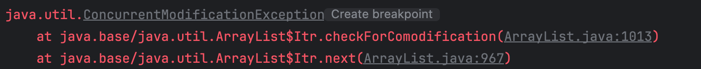

# 컬렉션 / 배열 순회
```java
// 컬렉션 순회
List<String> c = new ArrayList<>();
for (Iterator<Element> i = c.iterator(); i.hasNext(); ) {
    Element e = i.next();
...  // e로 무언가를 한다.
}

// 배열 순회
String[] a = new String[]{"a", "b", "c"};
for (int i = 0; i < a.length; i++) {
        ... // a[i]로 무언가를 한다.
}
```
- 반복자와 인덱스 변수는 코드를 지저분하게 한다.
- 쓰이는 요소 종류가 늘어나면 오류가 생길 가능성이 높아진다.
- 컬렉션이냐 배열이냐에 따라 코드 형태가 상당히 달리잔다.

# for-each문 (향상된 for문)
```java
for (Element e : elements) {
    ... // e로 무언가를 한다.
}
```
- 반복자와 인덱스 변수를 사용하지 않아 코드가 깔끔해지고 오류가 날 일도 없다.
- 하나의 관용구로 컬렉션과 배열을 모두 처리할 수 있어 어떤 컨테이너를 다루는지 신경쓰지 않아도 된다.
- 콜론(:)은 "안의(in)"라고 읽으면 된다.
  - 따라서 이 반복문은 "elements 안의 각 원소 e에 대해"라고 읽는다.

## 컬렉션 중첩 순회
### 문제 발생
- 다음은 반복문을 중첩하여 모든 카드 종류를 만드는 코드이다.
- 잘못된 부분을 찾아보자.
```java
enum Suit {CLOVER, DIAMOND, HEART, SPADE}
enum Rank {ACE, TWO, THREE, FOUR, FIVE, SIX, SEVEN, EIGHT, NINE, TEN, JACK, QUEEN, KING}

static Collection<Suit> suits = Arrays.asList(Suit.values());
static Collection<Rank> ranks = Arrays.asList(Rank.values());

List<Card> deck = new ArrayList<>();
for (Iterator<Suit> i = suits.iterator(); i.hasNext(); ) {
        for (Iterator<Rank> j = ranks.iterator(); j.hasNext(); ) {
        deck.add(new Card(i.next(), j.next()));
    }
}
```
- 마지막 줄의 `i.next()`는 `문양(Suit) 하나당 한 번`씩만 불려야 하는데, 안쪽 반복문에서 호출되어서 `카드(Rank) 하나당 한 번`씩 불리고 이싿.
  - 따라서 `CLOVER ACE`, `DIAMOND TWO`, `HEART THREE`, `SPADE FOUR` 총 4장의 카드만 만들고 `NoSuchElementException`을 던진다.
### 더 큰 문제 발생
- 만약 바깥 컬렉션의 크기와 안쪽 컬렉션의 크기가 같다면 우리가 원하는 일을 수행하지도 않고, 예외도 던지지 않은 채로 종료된다.
```java
enum Face {ONE, TWO, THREE, FOUR, FIVE, SIX}

Collection<Face> faces = EnumSet.allOf(Face.class);

for(Iterator<Face> i = faces.iterator(); i.hasNext(); ) {
    for (Iterator<Face> j = faces.iterator(); j.hasNext(); ) {
        System.out.println(i.next() + " " + j.next());
    }
}
```
- 이 프로그램은 예외를 던지진 않지만 아래 여섯 쌍만 출력하고 끝나버린다.
  - `ONE ONE`, `TWO TWO`, `THREE THREE`, `FOUR FOUR`, `FIVE FIVE`, `SIX SIX`
### 해결법
- 바깥 반복문에 바깥 원소를 저장하는 변수를 하나 추가한다.
```java
for (Iterator<Suit> i = suits.iterator(); i.hasNext(); ) {
    Suit suit = i.next();
    for (Iterator<Rank> j = ranks.iterator(); j.hasNext(); ) {
        deck.add(new Card(suit, j.next()));
    }
}
```
### 제일 쉬운 해결법
- for-each문을 중첩하는 것으로 간단히 해결된다.
```java
for (Suit suit : suits) {
    for (Rank rank : ranks) {
        deck.add(new Card(suit, rank));
    }
}
```
# for-each문을 사용할 수 없는 경우
## 파괴적인 필터링
- 컬렉션을 순회하며 선택된 원소를 제거해야 하는 경우 반복자의 remove 메서드를 호출해야 한다.
- 자바 8부터 `Collection`의 `removeIf` 메서드를 사용하여 해결할 수 있다.
```java
List<CardNo> cardNos = new ArrayList<>();
cardNos.add(new CardNo(1));
cardNos.add(new CardNo(2));
cardNos.add(new CardNo(3));
cardNos.add(new CardNo(4));

for (CardNo cardNo : cardNos) {
    if (cardNo.number == 1) {
        cardNos.remove(cardNo);
    }
}
```


```java
cardNos.removeIf(cardNo -> cardNo.number == 1);
```
## 변형
- 리스트나 배열을 순회하면서 원소의 값 일부 혹은 전체를 교체해야 한다면 리스트의 반복자나 배열의 인덱스를 사용해야 한다.
```java
List<CardNo> cardNos = new ArrayList<>();
cardNos.add(new CardNo(1));
cardNos.add(new CardNo(2));
cardNos.add(new CardNo(3));
cardNos.add(new CardNo(4));

for (int i = 0; i < cardNos.size(); i++) {
    if (cardNos.get(i).number == 1) {
        cardNos.set(i, 10); 
    }
}
```
## 병렬 반복
- 여러 컬렉션을 병렬로 순회해야 한다면 각각의 반복자와 인덱스 변수를 사용해 엄격하고 명시적으로 제어해야 한다.
```java
enum Face {ONE, TWO, THREE, FOUR, FIVE, SIX}

Collection<Face> faces = EnumSet.allOf(Face.class);

for(Iterator<Face> i = faces.iterator(); i.hasNext(); ) {
    for (Iterator<Face> j = faces.iterator(); j.hasNext(); ) {
        System.out.println(i.next() + " " + j.next());
    }
}
```

- for-each문은 `Iterable` 인터페이스를 구현한 객체라면 무엇이든 순회할 수 있다.
```java
public interface Iterable<E> {
    Iterator<E> iterator();
}
```
- 원소들의 묶음을 표현하는 타입을 작성해야 한다면 `Iterable`을 구현하는 쪽으로 고민해봐라.