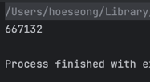
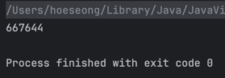
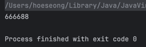

# 직접 만든 메서드의 문제점
- 아래 코드는 0 ~ n 사이의 무작위 정수 하나를 생성하고, 이를 이용해 중간 값보다 작은 게 몇 개인지 출력하는 코드이다.
```java
static Random rnd = new Random();

static int random(int n) {
    return Math.abs(rnd.nextInt()) % n;
}

public static void main(String[] args) {
    int n = 2 * (Integer.MAX_VALUE / 3);
    int low = 0;
    for (int i = 0; i < 1_000_000; i++) {
        if (random(n) < n/2) {
            low++;
        }
    }
    System.out.println(low);
}
```
- 우리는 50만 개가 출력될 것을 기대했지만, 실제로는 666,666에 가까운 값을 얻는다.
  - 무작위로 생성된 수 중에서 2/3 가량이 중간값보다 낮은 쪽으로 쏠린 것이다.



## random 메서드의 문제점
1. n이 그리 크지 않은 2의 제곱수라면 얼마 지나지 않아 같은 수열을 반복한다.
2. n이 2의 제곱수가 아니라면 몇몇 숫자가 평균적으로 더 자주 반환된다.
    - n 값이 크면 이 현상은 더 두드러진다.
3. 지정한 범위 '바깥'의 수가 종종 튀어나온다.
   - `rnd.nextInt()`가 반환한 값을 `Math.abs`를 이용해 매핑하기 때문이다.
   - `nextInt()`가 `Integer.MIN_VALUE`를 반환하면 `Math.abs`를 해도 `Integer.MIN_VALUE`가 나온다.
     - `MIN_VALUE` 는 -2^31, `MAX_VALUE` 는 2^31 - 1 이기 때문이다.

## 해결 방법
- 이 문제를 해결하려면 의사난수 생성기, 정수론, 2의 보수 계산 등에 조예가 깊어야 한다.
- 다행히 `Random.nextInt(int)`가 이미 해결해놨다.
  - 자세한 동작 방식은 몰라도 된다.
- 알고리즘에 능통한 어떤 개발자가 설계와 구현과 검증에 시간을 들여 개발했고, 이 분야의 여러 전문가가 잘 동작함을 검증해줬다.
- 이 라이브러리가 릴리스된 후 20여 년 가까이 수백만의 개발자가 열심히 사용했지만 버그가 보고된 적이 없다.
  - 혹시 있더라도 다음 릴리스에서 수정된다.
- 즉, 표준 라이브러리를 사용하면 그 코드를 작성한 전문가의 지식과 여러분보다 앞서 사용한 다른 프로그래머들의 경험을 활용할 수 있다.

### 또 다른 대안
- 자바 7부터는 `Random` 대신 `ThreadLocalRandom`을 사용하자.
- 포크-조인 풀이나 병렬 스트림에서는 `SplittableRandom`을 사용하자.

# 표준 라이브러리를 사용하는 이점
- 핵심적인 일과 크게 관련 없는 문제를 해결하느라 시간을 허비하지 않아도 된다.
- 따로 노력하지 않아도 성능이 지속해서 개선된다.
- 기능이 점점 많아진다.
- 우리가 작성한 코드가 많은 사람에게 낯익은 코드가 된다.

# 그럼에도 많은 개발자가 직접 구현해서 쓰는 이유
- 라이브러리에 그런 기능이 있는지 모르기 때문일 것이다.
- 메이저 릴리스마다 주목할 만한 수많은 기능이 라이브러리에 추가된다.
  - 자바는 메이저 릴리스마다 새로운 기능을 설명하는 웹페이지를 공시한다.
- 라이브러리가 너무 방대하여 모든 API문서를 공부하기는 벅차지만, 적어도 `java.lang`, `java.util`, `java.io`와 그 하위 패키지들에는 익숙해져야 한다.
- 외에도 컬렉션 프레임워크와 스트림 라이브러리, `java.util.concurrent`의 동시성 기능 등도 알아두면 좋다.
  - `java.util.concurrent` 패키지는 멀티스레드 프로그래밍 작업을 단순화해주는 고수준의 편의 기능을 제공한다.
  - 또한 능숙한 개발자가 자신만의 고수준 개념을 직접 구현할 수 있도록 도와주는 저수준 요소들을 제공한다.
  - 이는 아이템 80과 81에서 다룬다.

# 결론
- 바퀴를 다시 발명하지 말자.
- 있으면, 쓰자.
- 모르겠으면, 찾아보자.